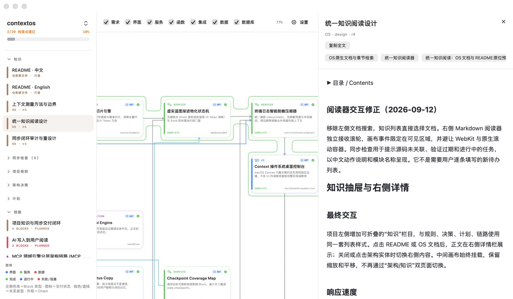
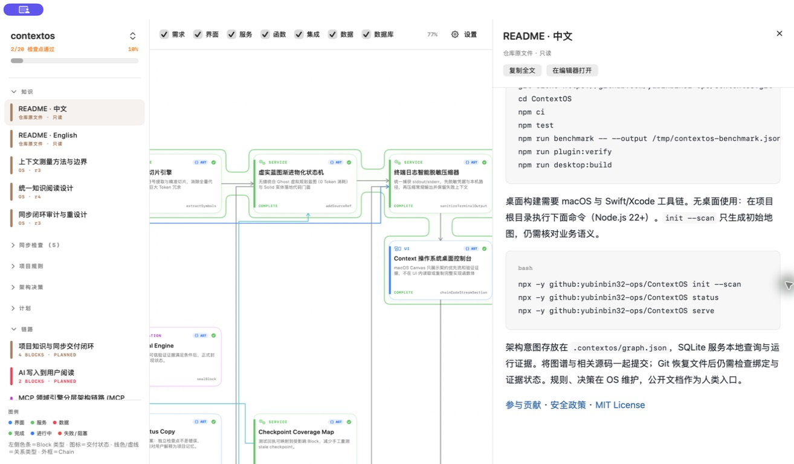

<div align="center">
  
  <h1>The project remembers. Every conversation can start where the last one stopped.</h1>
  <p><strong>ContextOS gives an AI coding project a durable architecture map, verified progress, compact command output, and exact code locations.</strong></p>
  <p><a href="https://github.com/yubinbin32-ops/ContextOS/releases/latest"><strong>Download the macOS App</strong></a> · <a href="#start-in-three-minutes">Start in three minutes</a> · <a href="README_zh.md">中文</a></p>
</div>


## The problem

An AI coding conversation starts with a blank memory. The agent rereads files to discover the architecture, asks you to repeat decisions, reconstructs unfinished work, and carries long build logs into the next turn. As a project grows, the conversation becomes a second, fragile documentation system.

ContextOS stores the project's working memory beside the code. The AI receives the small part that matters to the current task, while the App gives you a visual way to inspect the same architecture, progress, decisions, and documents.

## What it changes

**Architecture memory.** Blocks describe the project's modules and responsibilities. Typed Links describe real relationships. Chains show an observable feature path, so a new conversation can understand how a feature fits together before opening implementation code.

**Progress that stays synchronized.** Plans, PlanChanges, ChainScopes, source bindings, checkpoints, and handoffs are stored as structured records. The agent can resume a task from its current state instead of scanning files to guess what is finished.

**Commands without log overload.** `run_command` returns a redacted execution receipt and keeps the useful error or failure clue. Routine compilation output does not consume the rest of the context window.

**AST code locations.** Source bindings point to a file, symbol, signature, and derived line range. `chain_code_stream` returns locator-only feature paths. `block_code_stream` returns a bounded AST slice for one implementation when code is needed, instead of returning the containing file.

**Knowledge with a clear owner.** Internal proposals, audits, and guides live as OS Documents. `README.md` and `README_zh.md` remain public repository files and are previewed read-only in the App, with their images and relative links intact.




The result is an ordinary conversation. After installation, you do not need to mention ContextOS or repeat a tool name in every turn. Describe the work; the plugin reads and updates the project memory in the background. For a first map or a progress check, natural requests such as “map this project's architecture” or “continue the unfinished work” are enough.

## Start in three minutes

### macOS App

1. [Download the latest App](https://github.com/yubinbin32-ops/ContextOS/releases/latest), unzip it, and open **ContextOS**.
2. Open **Settings**, choose the detected AI editor, and click **Install / Sync Plugin**.
3. Open the same project in Codex or your editor. Confirm that **ContextOS** is listed as an installed plugin, then start working.

The App supports macOS 14 or later. The MCP runtime needs Node.js 22 or later. The App writes the editor configuration for you; there is no configuration file to compose by hand.


### Other operating systems

There is no macOS App requirement. Install the ContextOS plugin/MCP entry in the AI editor you use. The repository also provides a headless CLI:

```bash
npx -y github:yubinbin32-ops/ContextOS init --scan
npx -y github:yubinbin32-ops/ContextOS setup
```

Use `serve` as the MCP command when your editor asks for a server. `status` and `sync` are available for a quick installation check.

## A normal workflow

1. Install once and open a project.
2. Ask for the feature, fix, review, or design in ordinary language.
3. Let the agent use the stored architecture and progress while it works.
4. At the end, the agent records the code locations, command receipt, verification, and next action.

You can still ask “what is the current project progress?” or “show me the architecture” at any time. These are requests for a view, not a special conversation protocol.



## Reproducible benchmark

The measurements below were run on September 12, 2026 against this repository's isolated graph snapshot. They measure service responses and JavaScript UTF-16 characters; they are not model-token or session-compaction measurements.

| Measurement | Result |
|---|---:|
| Full graph reference | 801,864 characters |
| Task context budget | 4,000 characters |
| Context reduction | **99.50%** (801,864 → 4,000) |
| Chain: four complete source files → locator stream | **99.07%** (223,360 → 2,071) |
| Fixed synthetic build log | **91.78%** (10,071 → 828), with the error and failure retained |
| Context query samples | 12 local calls |
| Query latency p50 / p95 | **672.74 ms / 710.84 ms** |

The four task queries each returned the expected reference and visible locator inside the 4,000-character budget:

| Query | Expected Block | Latencies (ms) | Reduction |
|---|---|---:|---:|
| OpenCode platform support and MCP injection | `in-app-plugin-install` | 710.84 · 699.53 · 677.65 | 99.50% |
| Git Discard and SQLite hot reload | `sqlite-graph-store` | 674.73 · 670.31 · 672.57 | 99.50% |
| CJK tokenization and BM25 weighted search | `context-retrieval` | 669.24 · 672.54 · 676.52 | 99.50% |
| SourceBinding path and symbol synchronization | `live-binding-refresh` | 687.22 · 670.38 · 672.74 | 99.50% |

The Chain measurement used `chain-context-os` and returned four anchored locators: `ast-facade-engine/extractSymbols`, `progressive-materializer/addSourceRef`, `terminal-sanitizer/sanitizeTerminalOutput`, and `desktop-context-console/chainCodeStreamSection`. The full raw data is in [`docs/benchmarks/2026-09-12-v040.json`](docs/benchmarks/2026-09-12-v040.json).

The author's daily use suggests roughly 60% fewer context compactions. That is a personal experience report, not a controlled comparison. The benchmark excludes the MCP envelope, tool descriptions, skill instructions, follow-up source reads, reasoning, model tokenization, cost, and task success. Full graph and full-file sizes are reference points rather than a competent-agent baseline. The 12 calls mix first and warm reads, so their latency is not a production percentile.

Run the measurement again after changing the service or graph:

```bash
npm run benchmark -- --output docs/benchmarks/2026-09-12-v040.json
```

## For contributors

```bash
git clone https://github.com/yubinbin32-ops/ContextOS.git
cd ContextOS
npm ci
npm test
npm run plugin:verify
npm run desktop:build       # macOS + Swift/Xcode
```

The versioned `.contextos/graph.json` is the project's portable graph projection. Internal narrative documents belong in the OS; benchmark JSON and public README files remain repository artifacts.

[Contributing](CONTRIBUTING.md) · [Security](SECURITY.md) · [MIT License](LICENSE)
