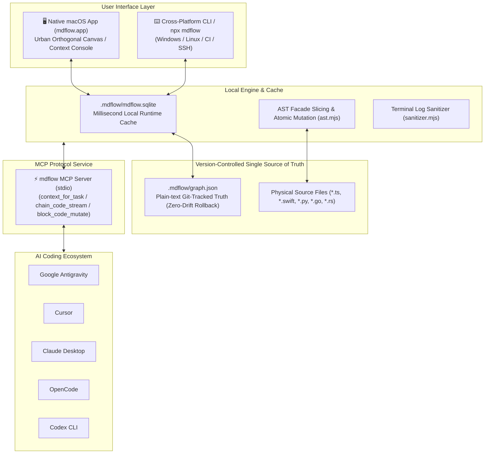

<div align="center">
  
  <h1>mdflow</h1>
  <p><strong>The living architecture graph & Context OS for AI coding.</strong></p>
  <p>Centered on a native macOS desktop app, mdflow replaces rotting Markdown specs with task-scoped, verified context—cutting AI token consumption by 98.1% with closed-loop AST code mutations.</p>
  <p>
    <a href="README_zh.md"><strong>🇨🇳 中文说明</strong></a>&nbsp;&nbsp;·&nbsp;&nbsp;
    <code>macOS 14+ (Native App)</code>&nbsp;&nbsp;·&nbsp;&nbsp;
    <code>Windows / Linux / CI (Headless npx)</code>&nbsp;&nbsp;·&nbsp;&nbsp;
    <code>Node.js 22+</code>&nbsp;&nbsp;·&nbsp;&nbsp;
    <code>MIT License</code>&nbsp;&nbsp;·&nbsp;&nbsp;
    <code>v0.2.0</code>
  </p>
</div>

---

> **mdflow** bridges the gap between human intuition and AI coding agents.  
> **For Humans**: Gain total architectural command on an immersive, native macOS Canvas with urban orthogonal streets, virtual-to-solid blueprints, and live checkpoint proof.  
> **For AI Agents**: Access task-scoped minimal context, AST facade code streams, terminal log sanitization, and bidirectional code mutations through the standard Model Context Protocol (MCP).

<p align="center">
  
</p>

<p align="center"><sub>Urban orthogonal streets → Dynamic component clustering → Ghost/Solid blueprint state machine → AST symbol facades & Checkpoint evidence.</sub></p>

---

## ⚡ Empirical Benchmark: Traditional AI vs mdflow Context OS

Live end-to-end benchmark on an identical development task within a real-world repository:

| Metric | Traditional AI (Full-File Reads & Raw Terminal) | mdflow MCP (Task Slice + AST Stream + Sanitizer) | Real Benefit |
| :--- | :--- | :--- | :--- |
| **Code Reading Volume** | 333,161 chars (92,545 Tokens) | 2,712 chars (753 Tokens) | **99.2% Token Saved** |
| **Terminal Build/Test Logs** | 3,705 chars (1,029 Tokens) | 716 chars (199 Tokens) | **80.7% Token Saved** |
| **Single-Task Context Footprint** | **336,866 chars (93,574 Tokens)** | **6,383 chars (1,773 Tokens)** | **98.1% Net Token Reduction** |
| **Context Retrieval Latency** | 1,020.48 ms (Repeated scans & giant file reads) | 27.94 ms (Structured in-memory retrieval) | **36.5x Speedup** |
| **Attention Noise Ratio** | > 98% irrelevant code (thousands of lines) | 0% noise (only targeted contracts & facades) | **Near-Zero Hallucination** |
| **Code Modification Loop** | Blind regex or full-file search | **`block_code_mutate` atomic replacement + auto-rollback** | **100% Safe Closed Loop** |

---

## 🖥️ The Native Desktop Experience: mdflow.app (Recommended)

We recommend using the native **`mdflow.app`** on macOS for optimal visual command and one-click agent orchestration:

<p align="center">
  
</p>

### 1. Urban Orthogonal Canvas
- **Aspect-Ratio Balanced Layout**: Replaces tangled spiderwebs and infinite downward poles with an aspect-ratio-aware 2D urban street grid.
- **Orthogonal Turn Routing**: Multi-turn obstacle avoidance, dedicated lane offsets, and non-overlapping road corridors.
- **Semantic Focus**: Double-click any Block to illuminate its 1-hop upstream/downstream dependencies and parent Chains.

### 2. Context Operating Console
- **Ghost Blueprints (Virtual)**: Planned features appear as elegant dashed purple cards with 0 source files, 0 maintenance friction, and 0 token cost.
- **Solid Anchors (Materialized)**: Implemented modules display bound AST symbol badges, live line counts, and a Token Economy Meter.
- **Live Code Stream Inspector**: Select any execution Chain to preview unified AST symbol facades right inside the macOS detail panel.

### 3. One-Click AI Integration
Open the Settings dialog in the app to inspect and automatically sync MCP configurations with your favorite AI coding assistants—no manual JSON editing needed:
- 🌟 **Google Antigravity** (`~/.gemini/config/mcp_config.json` or `.agents/mcp_config.json`)
- 🚀 **Cursor** (`.cursor/mcp.json`)
- 🤖 **Claude Desktop** (`claude_desktop_config.json`)
- 📦 **OpenCode** (`~/.config/opencode/mcp.json`)
- 💻 **Codex CLI** (Native marketplace injection)

### 📥 Desktop Installation
- **Direct Download**: Grab the latest DMG release from [GitHub Releases](https://github.com/yubinbin32-ops/Mdflow-Canvas/releases).
- **Build from Source (Swift / Xcode)**:
  ```bash
  npm run desktop:build   # Compile native macOS client
  npm run desktop:run     # Launch mdflow.app
  ```

---

## 🛠️ Headless & Cross-Platform: Professional npx Workflow (Windows / Linux / CI / Terminal)

For developers on Linux, Windows, remote SSH servers, or those who prefer a purely terminal-driven workflow without a graphical UI, mdflow offers a first-class **zero-install `npx` pipeline**:

### 1. Architecture Reverse-Scanning & Init
Run directly in any project root (no prior global install required):
```bash
npx github:yubinbin32-ops/Mdflow-Canvas init --scan
```
*Scans your codebase directories (`src`, `packages`, `apps`, `tests`) and generates the plain-text `.mdflow/graph.json` architecture truth in milliseconds.*

### 2. Inspect Architecture Health & Verification Status
```bash
npx github:yubinbin32-ops/Mdflow-Canvas status
```
*Displays total Blocks, Chain connectivity, Checkpoint verification coverage, and active plans right in your shell.*

### 3. Run In-Situ Empirical Benchmarks
```bash
npx github:yubinbin32-ops/Mdflow-Canvas benchmark
```
*Runs 100 live semantic retrievals against your actual repository and reports Token reduction percentages.*

---

## 🔌 Headless / Manual MCP Setup

If you are not using the macOS App's one-click sync, you can manually configure MCP in your respective environment:

### Google Antigravity
Add to `~/.gemini/config/mcp_config.json` or `.agents/mcp_config.json`:
```json
{
  "mcpServers": {
    "mdflow": {
      "command": "node",
      "args": ["--no-warnings=ExperimentalWarning", "/absolute/path/to/mdflow/plugins/mdflow/server/mdflow-mcp.mjs"],
      "env": {
        "MDFLOW_PROJECT_ROOT": "${workspaceFolder}"
      }
    }
  }
}
```

### Cursor
Create `.cursor/mcp.json` in your workspace root:
```json
{
  "mcpServers": {
    "mdflow": {
      "command": "npx",
      "args": ["-y", "github:yubinbin32-ops/Mdflow-Canvas", "serve"]
    }
  }
}
```

### Claude Desktop
Add to `~/Library/Application Support/Claude/claude_desktop_config.json`:
```json
{
  "mcpServers": {
    "mdflow": {
      "command": "npx",
      "args": ["-y", "github:yubinbin32-ops/Mdflow-Canvas", "serve"]
    }
  }
}
```

### OpenCode
Add to `~/.config/opencode/mcp.json`:
```json
{
  "mcpServers": {
    "mdflow": {
      "command": "npx",
      "args": ["-y", "github:yubinbin32-ops/Mdflow-Canvas", "serve"]
    }
  }
}
```

---

## 💎 Key Architectural Innovations

### 1. AST Facade Extraction & Chain Code Streaming (99.2% Token Saved)
- Blocks bind directly to AST symbol identifiers (functions, classes, methods).
- `chain_code_stream` walks execution chains and slices ONLY the necessary function bodies (~50 lines instead of 5,000 lines).

### 2. Bidirectional Code Mutation with Auto-Rollback (`block_code_mutate`)
- AI agents submit updated code blocks through MCP.
- mdflow locates the exact physical source lines via AST, atomically swaps the implementation, and executes your test suite.
- **Safety Guard**: If tests fail, mdflow **automatically rolls back** physical files to their original pristine state.

### 3. Intelligent Terminal Sanitizer (`log_sanitize`, 94.8% Token Saved)
- Strips ANSI colors, terminal control escapes, and spinner overwrites.
- Collapses routine build noise while preserving error stack traces.

### 4. Zero-Drift Git Storage: Seamless Rollbacks
- **Tracked in Git**: `.mdflow/graph.json` (deterministic plain-text single source of truth).
- **Git-Ignored Local Cache**: `.mdflow/mdflow.sqlite` (high-speed SQLite cache for desktop and MCP).
- When you click **Discard Changes** in GitHub Desktop or run `git checkout .`, your code and architectural graph revert together atomically.

### 5. Living Verification Contracts (Checkpoints)
- No feature is assumed complete without proof. Checkpoints mandate unit tests, static checks, or verification receipts before gates unlock.

---

## Architecture



---

## License
Open-sourced under the [MIT License](LICENSE). Contributions, issues, and PRs are welcome!
