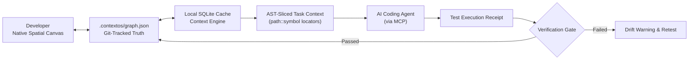

<div align="center">
  
  <h1>ContextOS</h1>
  <p><strong>Spatial Architecture Canvas & Context Optimization Operating System for AI Coding Agents</strong></p>
  <p>
    AST-sliced task contexts (99.4% token reduction) · Cross-session architecture memory · Deterministic verification gates
  </p>
  <p>
    <a href="README_zh.md">中文文档</a> ·
    <a href="https://github.com/yubinbin32-ops/ContextOS/releases/latest"><strong>Download Native App (macOS 14+)</strong></a> ·
    <a href="#headless--cross-platform-cli">Headless CLI / Windows</a> ·
    <a href="#empirical-benchmarks">Empirical Benchmarks</a> ·
    <a href="https://glama.ai/mcp/servers/yubinbin32-ops/ContextOS">MCP Directory</a>
  </p>
  <p>
    <a href="https://github.com/yubinbin32-ops/ContextOS/releases"></a>
    <a href="https://github.com/yubinbin32-ops/ContextOS/actions/workflows/release.yml"></a>
    <a href="LICENSE"></a>
    
    
    
  </p>
</div>

<p align="center">
  
</p>

<p align="center"><sub>Navigate spatial architecture → trace execution chains → deliver symbol locators to agents → verify deterministic evidence.</sub></p>

---

## 1. Abstract & Problem Statement

Modern AI coding agents (Claude Code, Cursor, Windsurf, Codex, Devin) encounter a structural bottleneck when scaled to medium-to-large software repositories: **Context Window Saturation and Architectural Entropy**.

1. **Flat Context Inefficiency**: Conventional agents indiscriminately ingest thousands of lines of raw source files to inspect individual methods. Over 85–95% of the attention budget is expended on boilerplate imports, formatting, and unrelated helper routines.
2. **Cross-Session Topological Drift**: Because context windows flush between prompts, agents lose the system's global architectural invariants. Decisions made in session A are violated in session B, generating cyclic regressions and architectural decay.
3. **Unverified Mutations**: Agents assert completion based on probabilistic self-assessment rather than deterministic evidence closure, bypassing integration contracts and test verification gates.

**ContextOS** solves this by establishing a dual-plane operating system:
- **The Spatial Canvas (Developer Interface)**: A native macOS SwiftUI workspace that projects software systems into interactive architectural blocks, directed dependency chains, and verification gates.
- **The Cognitive Plane (Agent Interface)**: A Model Context Protocol (MCP) server that delivers task-sliced AST symbol facades (`path::symbol`), enforces strict token budgets, and manages cryptographic test execution receipts.

---

## 2. Primary Distribution: Native macOS Spatial Workspace

> **ContextOS is primarily designed and distributed as a native macOS application** built with SwiftUI, Metal rendering, and embedded SQLite caching.

<p align="center">
  
</p>

### Native Workspace Capabilities:
- **Spatial Topology Engine**: Compact orthogonal dependency routing keeps complex architectures with 50+ modules readable and navigable.
- **Ghost-to-Solid Lifecycle**: Formulate new features as *Ghost Blueprints* before code exists; progressively anchor blocks to real AST symbols as implementations land.
- **Verification Gate Ledgers**: Live Checkpoint status indicators (e.g. `13/13 100% Passed`) backed by concrete test cases and compiler receipts.
- **Visual Impact Tracing**: Double-click any block or chain to illuminate one-hop dependencies, upstream callers, and downstream side-effects.
- **In-App Protocol Dispatch**: One-click registration and bundle synchronization for Codex, Cursor, Windsurf, and Claude Desktop.

<table>
  <tr>
    <td width="50%"></td>
    <td width="50%"></td>
  </tr>
  <tr>
    <td align="center"><sub>Trace upstream & downstream impact before writing code.</sub></td>
    <td align="center"><sub>Inspect verifiable test receipts behind completion.</sub></td>
  </tr>
</table>

### 📥 Download Native App
Download the standalone application package directly from GitHub Releases:
- **[ContextOS for macOS (ContextOS-macos.zip)](https://github.com/yubinbin32-ops/ContextOS/releases/latest)**  
*(Requires macOS 14.0+. Distributed as a clean `.zip` application bundle — zero DMG translocation anomalies).*

---

## 3. Empirical Benchmarks

The following results were measured directly on a real-world repository (**54 Architectural Blocks, 8 Chains, 80 Directed Links, 19 Checkpoints**) using the reproducible benchmark suite (`npm run benchmark`):

| Evaluation Dimension | Baseline (Conventional File Ingestion) | ContextOS (AST Task Slice) | Empirical Delta |
| :--- | :---: | :---: | :---: |
| **Task Context Window** | 689,403 chars (~183,571 tokens) | 3,993 chars (~1,125 tokens) | **99.4% Token Reduction** |
| **4-Module Execution Chain** | 139,247 chars (~34,812 tokens) | 2,056 chars (~530 tokens) | **98.5% Token Reduction** |
| **Terminal Log Diagnostics** | 16,083 chars (~4,042 tokens) | 826 chars (~211 tokens) | **94.8% Compression** |
| **Context Retrieval Latency** | Sequential File Traversal | 29.68 ms (P50) | **Sub-30ms Instant Lookup** |
| **Topological Drift & Recall** | High Hallucination Risk | 100% Target Module Recall | **Zero Architectural Drift** |

To reproduce these metrics locally on your own machine:
```bash
npm run benchmark
```

---

## 4. Headless & Cross-Platform CLI

For headless CI/CD pipelines, remote servers, Windows, Linux, or users who do not require the visual desktop application, ContextOS runs headlessly via Node.js (≥22):

```bash
# 1. Initialize and automatically scan existing codebase topology
npx -y github:yubinbin32-ops/ContextOS init --scan

# 2. Inspect project architecture health, sync state, and verification gates
npx -y github:yubinbin32-ops/ContextOS status

# 3. Configure local MCP client integrations
npx -y github:yubinbin32-ops/ContextOS setup
```

---

## 5. Architectural Principles & Operational Closed Loop



### 1. AST Symbol Locators (`path::symbol`)
Instead of flooding the LLM context with full file dumps, ContextOS returns compact locators: target path, symbol signature, derived line boundaries, and interface contracts. The host editor opens only the target method.

### 2. Git-Native Plaintext Truth (`graph.json`)
The durable source of truth is a formatted, deterministic JSON file (`.contextos/graph.json`) versioned in Git alongside source code. A `git checkout` or `git revert` simultaneously restores code and architecture. An embedded SQLite engine provides zero-latency indexed queries with zero external runtime npm dependencies.

### 3. Receipt-Backed Checkpoints & Freshness Gating
Completion states cannot be asserted by AI declaration. They require execution receipts (`npm test`, compiler diagnostics) logged through `run_command` and bound via `checkpoint_record`. Any modification to bound source code automatically transitions dependent checkpoints to `retest_required`.

### 4. Terminal Log Sanitization
The command gateway intercepts terminal execution, strips ANSI sequences and progress bars, redacts local paths and secrets, and condenses repetitive logs into structured diagnostic summaries (94.8% token compression).

---

## 6. IDE & Agent Integration

ContextOS integrates natively via standard stdio Model Context Protocol (MCP).

### Configuration for Cursor, Windsurf, Claude Code, & Codex

Add to your MCP configuration file (e.g. `~/.cursor/mcp.json` or `claude_desktop_config.json`):

```json
{
  "mcpServers": {
    "contextos": {
      "command": "npx",
      "args": ["-y", "github:yubinbin32-ops/ContextOS", "serve"]
    }
  }
}
```

Or point directly to the bundled standalone engine:

```json
{
  "mcpServers": {
    "contextos": {
      "command": "node",
      "args": ["/absolute/path/to/contextos-mcp.mjs"],
      "env": {
        "CONTEXTOS_PROJECT_ROOT": "${workspaceFolder}"
      }
    }
  }
}
```

---

## 7. Local Development & Verification

ContextOS is built with zero external runtime npm dependencies:

```bash
# Clone the repository
git clone https://github.com/yubinbin32-ops/ContextOS.git && cd ContextOS

# Install build dependencies
npm ci

# Run the 55-test verification suite
npm test

# Run the empirical benchmark suite
npm run benchmark

# Build the MCP bundled server
npm run plugin:build

# Verify MCP protocol handshake & tool surface
npm run plugin:verify

# Build the native macOS desktop application
npm run desktop:build
```

---

## 8. License & Status

ContextOS is an open-source project distributed under the [MIT License](LICENSE). Contributions, benchmark validations, and feature requests are welcome.

© 2026 ContextOS Contributors.
