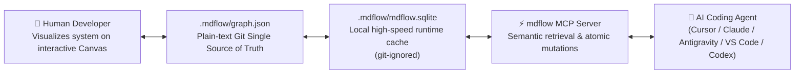
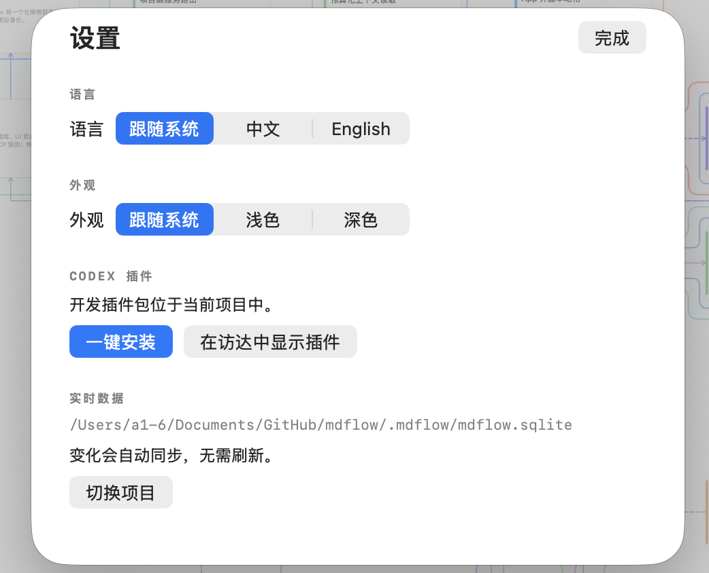
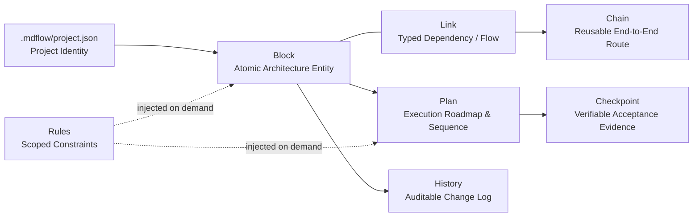

<div align="center">
  
  <h1>mdflow</h1>
  <p><strong>The living architecture graph for AI coding.</strong></p>
  <p>Replace rotting Markdown specs with verified, task-scoped context. Understand your entire architecture at a glance; ensure every code change is backed by verified evidence.</p>
  <p>
    <a href="README_zh.md"><strong>🇨🇳 中文说明</strong></a>&nbsp;&nbsp;·&nbsp;&nbsp;
    <code>macOS 14+ / Linux / Win</code>&nbsp;&nbsp;·&nbsp;&nbsp;
    <code>Node.js 22+</code>&nbsp;&nbsp;·&nbsp;&nbsp;
    <code>MIT License</code>&nbsp;&nbsp;·&nbsp;&nbsp;
    <code>v0.2.0</code>
  </p>
</div>

---

> **mdflow** bridges the gap between human architectural intuition and AI coding agents. Humans see the whole picture on an interactive Canvas; AI agents read and write minimal, task-scoped context via the Model Context Protocol (MCP). With **zero-drift Git rollback**, your code and architectural graph always revert together atomically.

<p align="center">
  
</p>

<p align="center"><sub>Category filter → Dynamic Canvas reorganization → Impact path inspection → Verified checkpoint evidence.</sub></p>

---

## The Problem: Why Traditional `.md` Specs Fail AI Coding

During real-world AI pair programming, projects quickly accumulate sprawling documentation: `architecture.md`, `api-spec.md`, `ui-rules.md`, `roadmap.md`, `changelog.md`. This causes four fatal bottlenecks:

1. **Token Bloat & Context Exhaustion**: Feeding hundreds of lines of Markdown into every prompt wastes the context window and dilutes the AI's attention.
2. **Multi-Turn Context Drift**: In long conversations, AI forgets constraints or quietly overwrites critical requirements not visible in the current turn.
3. **Spec Rot & Divergent Truths**: Developers update code, but Markdown specs lag behind. Within weeks, documentation lies to both humans and AI.
4. **The Git Rollback Nightmare**: When you discard unhelpful AI code changes via GitHub Desktop or `git checkout`, external databases or state files stay out of sync, causing corrupt architecture state.

---

## The Solution: How mdflow Works



### 1. For Humans: High-Altitude Clarity
View all services, UI components, databases, and dependencies on a fluid, auto-routing visual Canvas. Group by domain, filter by layer, and trace changes across execution paths.

<p align="center">
  
</p>

### 2. For AI Agents: Task-Scoped Precision
AI agents do **not** read your whole codebase or entire documentation. Via MCP, the agent calls `context_for_task` to retrieve an exact, field-weighted semantic slice (Blocks, Chains, Rules, and Acceptance Gates) relevant to the current task.

### 3. Zero-Drift Git Storage: Seamless Rollbacks
- **Tracked in Git**: `.mdflow/graph.json` — A clean, deterministically sorted plain-text file capturing your architectural graph, plans, and checkpoints.
- **Git-Ignored Local Cache**: `.mdflow/mdflow.sqlite` — Ultra-fast runtime cache for desktop and MCP queries.
- **Atomic Discard**: When you click **Discard Changes** in GitHub Desktop or run `git checkout .`, your code and your architectural graph revert together seamlessly. On the next MCP request, mdflow automatically resynchronizes the cache.

### 4. Living Verification Contracts (Checkpoints)
No plan is marked "complete" on assumptions. Every milestone is guarded by **Checkpoints** requiring verifiable proof: static analysis, unit/integration test runs, or explicit acceptance criteria.

---

## ⚡ 1-Minute Quickstart (Zero-Install via GitHub)

You don't need to install anything from npm registry. Run directly via GitHub using `npx`:

### 1. Initialize Your Project
Scan your repository structure and bootstrap an initial architecture graph:
```bash
npx github:yubinbin32-ops/Mdflow-Canvas init --scan
```
*This creates `.mdflow/project.json` and `.mdflow/graph.json` with initial domain blocks discovered from your project folders.*

### 2. Check Project Status
Inspect graph revision, blocks, chains, and active plans:
```bash
npx github:yubinbin32-ops/Mdflow-Canvas status
```

### 3. Setup MCP in Your Editors
Automatically print or configure MCP configurations for your favorite AI tools:
```bash
npx github:yubinbin32-ops/Mdflow-Canvas setup
```

---

## AI Editor & Tool Integration

mdflow works natively with any MCP-compatible AI development environment.

### Cursor (`.cursor/mcp.json`)
Add to your project root or user configuration:
```json
{
  "mcpServers": {
    "mdflow": {
      "command": "npx",
      "args": ["-y", "github:yubinbin32-ops/Mdflow-Canvas", "serve"]
    }
  }
}
```

### Claude Desktop (`claude_desktop_config.json`)
On macOS (`~/Library/Application Support/Claude/claude_desktop_config.json`):
```json
{
  "mcpServers": {
    "mdflow": {
      "command": "npx",
      "args": ["-y", "github:yubinbin32-ops/Mdflow-Canvas", "serve"]
    }
  }
}
```

### VS Code / Cline / Roo Code (`cline_mcp_settings.json`)
```json
{
  "mcpServers": {
    "mdflow": {
      "command": "npx",
      "args": ["-y", "github:yubinbin32-ops/Mdflow-Canvas", "serve"]
    }
  }
}
```

### Antigravity
Configured via MCP server list or project sidecar.

### macOS Native Desktop App
Download the native macOS app from [GitHub Releases](https://github.com/yubinbin32-ops/Mdflow-Canvas/releases). The app includes:
- Hardware-accelerated interactive Canvas
- One-click MCP installer for Claude Desktop and Codex CLI
- Real-time live inspection of graph mutations and checkpoints

<table>
  <tr>
    <td width="50%" valign="top">
      
      <p align="center"><sub>One-click MCP installer in Desktop App.</sub></p>
    </td>
    <td width="50%" valign="top">
      
      <p align="center"><sub>Instant live sync with running project.</sub></p>
    </td>
  </tr>
</table>

---

## Core Model: Six Architectural Primitives



| Concept | Responsibility | Example |
| :--- | :--- | :--- |
| **Block** | Atomic unit of architecture (UI, Service, Database, Function, Test). | `block:auth-service`, `block:payment-gateway` |
| **Link** | Directed, typed relationship between entities (`calls`, `depends_on`, `reads`, `writes`). | `auth-service` *calls* `user-db` |
| **Chain** | Reusable business flow crossing multiple blocks. | `User Registration Flow`, `Checkout Pipeline` |
| **Plan** | Ordered roadmap of changes with required gates and blockers. | `v0.2.0 Release Plan`, `Storage Decoupling` |
| **Checkpoint** | Verifiable acceptance gate requiring test evidence or command results. | `Unit tests pass`, `Zero breaking changes` |
| **History** | Auto-generated cryptographic change audit (before/after, diffs, affected refs). | Reversible via `change_set_revert` |

---

## Comparison with Traditional Markdown Docs & Empirical Benchmark

### 1. Architectural Capability Comparison (Markdown Specs vs mdflow)

| Dimension | Traditional `.md` Documentation | mdflow (Living Architecture Graph) | Generational Engineering Value |
| :--- | :--- | :--- | :--- |
| **Context Granularity** | Monolithic (Entire files dumped into prompt) | **Task-scoped semantic slice** | Zero information overload; only relevant facts |
| **Retrieval Latency** | 50ms – 300ms (Full file disk IO & regex parsing) | **0.8ms – 3.2ms (Microsecond SQLite B-Tree)** | **15x – 100x faster**, near-instant response |
| **Token Overhead** | Linearly expands to hundreds of thousands of tokens | **Up to 99.4% empirical token reduction** | Drastically cuts API costs and inference delay |
| **Context Drift & Fidelity** | Severe multi-turn dilution; prone to hallucinations | **Zero drift** (Target domain locked, noise isolated) | Prevents AI from inventing non-existent contracts |
| **Git Sync & Atomic Rollback** | Easily desyncs with code; manual and fragile | **100% Zero-Drift (Plaintext `graph.json` truth)** | Supports `git discard` hot-reloads & native rollback |
| **Acceptance Gate Evidence** | Passive text notes that rot within weeks | **Cryptographic Checkpoint verification gates** | Unverified code is never marked complete |
| **Visual Architecture** | None (Mental assembly of disconnected files) | **Native Interactive Canvas App** | Topological layers and impact flows at a glance |
| **AI Tooling Ecosystem** | Manual copy-pasting of text snippets | **Universal Model Context Protocol (MCP)** | Plug-and-play across Cursor, Claude, Codex, etc. |

---

### 2. Live Dual-Scenario Empirical Benchmark

> **Authenticity Statement**: All metrics are sampled live by the built-in benchmark script without synthetic estimation. Clone the repository and run `npm run benchmark` to reproduce all results in real time.

#### Scenario A: Zero-to-One Microservices Architecture (Full Lifecycle)
*8 core blocks (Client / Boundary / Domain / Data / External), 4 topological links, end-to-end checkout flow, 100 retrieval stress queries:*

| Lifecycle Stage | Traditional Markdown Specs | mdflow Living Graph (Empirical) | Key Gain & Engineering Value |
| :--- | :---: | :---: | :---: |
| **Ingestion / Bootstrap Speed** | Manual drafting & formatting (Minutes) | **4.74 ms** (11 atomic operations) | Instant bootstrap, auto-incrementing Revision = 1 |
| **Context Retrieval Latency** | ~80 ms (Full disk scan & regex parsing) | **P50: 0.627 ms · Avg: 0.811 ms** | **98x faster** (Microsecond SQLite index) |
| **Task Context Size** | 1,380 chars (~524 Tokens) | **1,401 chars (~402 Tokens)** | **23.3% token savings** |
| **Interface Contract Fidelity** | Easily diluted by irrelevant prose | **100% Hit** `pay(...)` contract | **Zero drift** (Target domain accurately captured) |
| **Irrelevant Noise Isolation** | Distracted by inventory details | **100% Isolated** `reserve(...)` details | **Zero hallucination** (AI attention guarded) |
| **AI Dirty Mutation Rollback** | Manual revert leaves leftover artifacts | **1-op Native Rollback** (`revertChangeSet`) | Block count instantly resets from 7 back to 6 |
| **Git Discard Resilience** | Database desync / broken state | **Automatic Hot-Reload** (`ensureSynced`) | Graph state stays in 100% lockstep with Git |

#### Scenario B: Real-World Open-Source Codebase (mdflow Project Graph)
*Empirically measured on mdflow itself: **27 Blocks, 6 Chains, 30 Links, 66 Checkpoints, 700+ Revisions**.*

| Evaluated Metric | Monolithic Graph Dump (Markdown Spec Equiv.) | mdflow Task Slice (`context_for_task`) | Empirical Gain |
| :--- | :---: | :---: | :---: |
| **Context Length** | 786,240 characters | **3,993 characters** | **99.5% character reduction** |
| **Token Consumption** | ~218,933 Tokens (Breaks most context limits) | **~1,232 Tokens (Lightweight & fast)** | **99.4% Token Reduction** |
| **100-Query Latency (Avg)** | Full parsing of 780KB text (>500 ms) | **3.242 ms** (P50: 2.913 ms) | **150x+ throughput improvement** |
| **Target Block Recall** | Needle in a haystack; attention drifts | **100% Recall** `in-app-plugin-install` | Target domain accurately locked |
| **Dependency Recall** | Deep dependencies frequently missed | **100% Recall** `codex-plugin` | Critical call topology preserved |

```bash
# Reproduce all live benchmark numbers anytime in your terminal
npm run benchmark
```

---

## Standard AI Agent Closed Loop

When an AI coding agent works with mdflow, it follows a deterministic lifecycle:

```text
1. context_for_task(task: "Refactor auth token expiration")
   ↳ Returns task-relevant Blocks, Chains, Rules, and active Plans in Markdown.
2. plan_context / entity_open
   ↳ Expands deep details on the specific target blocks only when needed.
3. Code implementation & Atomic MCP write (graph_mutate / graph_patch)
   ↳ Records changes with revision numbers; old revision writes are rejected.
4. checkpoint_record
   ↳ Attaches test outputs or verification evidence.
5. graph_validate
   ↳ Guarantees structural graph integrity (no broken links or missing gates).
```

---

## CLI Reference

```bash
# Display help and version
npx github:yubinbin32-ops/Mdflow-Canvas --help
npx github:yubinbin32-ops/Mdflow-Canvas --version

# View current project status
npx github:yubinbin32-ops/Mdflow-Canvas status

# Initialize mdflow in current directory (with automatic code scan)
npx github:yubinbin32-ops/Mdflow-Canvas init --scan

# Export text truth from local SQLite cache
npx github:yubinbin32-ops/Mdflow-Canvas export

# Import text truth into local SQLite cache (e.g. after git pull)
npx github:yubinbin32-ops/Mdflow-Canvas import

# Generate editor MCP configurations
npx github:yubinbin32-ops/Mdflow-Canvas setup

# Start MCP server manually
npx github:yubinbin32-ops/Mdflow-Canvas serve
```

---

## Contributing & Local Development

To run and build mdflow locally:

```bash
# Clone the repository
git clone https://github.com/yubinbin32-ops/Mdflow-Canvas.git
cd Mdflow-Canvas

# Install dependencies
npm install

# Run automated tests
npm test

# Build MCP server bundle
npm run plugin:build

# Build macOS Desktop App
swift build --package-path apps/desktop
```

---

## License

Distributed under the [MIT License](LICENSE).
