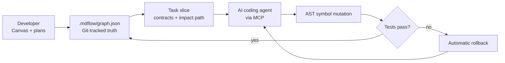

<div align="center">
  
  <h1>mdflow</h1>
  <p><strong>A context operating system for AI coding agents.</strong></p>
  <p>Map the system for humans. Stream only the relevant code to agents.<br />Let agents change code through verified, rollback-safe boundaries.</p>
  <p>
    <a href="README_zh.md">中文</a> ·
    <a href="https://dashend.cn">Website</a> ·
    <a href="https://github.com/yubinbin32-ops/Mdflow-Canvas/releases/latest">Download for macOS</a>
  </p>
  <p>
    <a href="https://github.com/yubinbin32-ops/Mdflow-Canvas/releases"></a>
    <a href="https://github.com/yubinbin32-ops/Mdflow-Canvas/actions/workflows/release.yml"></a>
    <a href="LICENSE"></a>
    
    
  </p>
</div>

<p align="center">
  
</p>

<p align="center"><sub>Filter the architecture → follow an impact path → inspect the exact code and verification evidence.</sub></p>

## The problem

Coding agents repeatedly scan the same repository, read entire files to understand one function, consume raw terminal noise, and lose architectural decisions between sessions. Markdown specs help at first, then drift away from the code they describe.

mdflow keeps a Git-tracked architecture graph beside the source. Its MCP server turns that graph into a narrow, verified working context for each task—and can apply symbol-level code changes with tests and automatic rollback.

| For developers | For AI agents |
| --- | --- |
| A native Canvas for architecture, dependencies, plans, progress, and evidence | Task-scoped context instead of repository-wide scanning |
| Ghost blueprints for planned work and solid anchors for implemented code | AST symbol slices across a complete execution chain |
| Impact paths before a change reaches the codebase | Atomic symbol mutation with verification and rollback |
| Git-native history: code and architecture move together | Sanitized terminal output that preserves useful failures |

## Try it on a repository

Requires Node.js 22 or later. No global install is needed.

```bash
cd your-project
npx -y github:yubinbin32-ops/Mdflow-Canvas init --scan
npx -y github:yubinbin32-ops/Mdflow-Canvas status
npx -y github:yubinbin32-ops/Mdflow-Canvas setup
```

On macOS 14+, download the native app from [GitHub Releases](https://github.com/yubinbin32-ops/Mdflow-Canvas/releases/latest) to explore the graph, focus dependencies, inspect code streams, and configure supported agents visually. The CLI and MCP server also run headlessly on Windows, Linux, CI, and remote machines.

## One closed loop



The runtime uses a local SQLite cache for fast reads. The durable source of truth is deterministic plain-text JSON, so a Git checkout or discard restores code and architecture together.

## Measured on mdflow itself

Run `npm run benchmark` to reproduce the measurements locally. Results vary by repository and task; these numbers come from the current mdflow codebase.

| Operation | Baseline | mdflow | Reduction / speed |
| --- | ---: | ---: | ---: |
| Task context | 112,738 tokens | 1,197 tokens | **98.9% fewer tokens** |
| Four-module code chain | 84,227 tokens | 654 tokens | **99.2% fewer tokens** |
| Build and test log | 4,042 tokens | 212 tokens | **94.8% fewer tokens** |
| Structured context retrieval | repeated file scans | 3.11 ms P50 | local indexed lookup |

The benchmark also checks target-module recall, related-topology capture, irrelevant-module isolation, checkpoint persistence, change-set reversal, and Git graph synchronization.

## What makes it different

### Architecture that can start before code

Planned features live as **Ghost Blueprints** without fake file bindings. As implementation lands, blocks become **Solid Anchors** connected to real AST symbols. The same object moves from intent to code to evidence.

### Code context at symbol boundaries

`chain_code_stream` follows an execution path across files and returns the relevant functions, classes, and contracts. Agents see the code that participates in the task instead of every line in every file.

### Code changes with a verification boundary

`block_code_mutate` locates a bound symbol, replaces it atomically, runs the configured verification command, and restores the original file when verification fails.

### Evidence as part of architecture

Plans and blocks can require Checkpoints backed by tests, static checks, or review receipts. Completion is tied to evidence rather than a chat claim.

### Terminal output built for agent context

`log_sanitize` removes ANSI control sequences, spinner rewrites, and repetitive successful output while keeping failure summaries and stack context.

## Native macOS Canvas

<p align="center">
  
</p>

- Compact orthogonal routing keeps large dependency graphs readable.
- Double-click focus reveals one-hop dependencies and related Chains.
- The Inspector shows AST bindings, code streams, plans, progress, and Checkpoint evidence.
- Settings can configure Google Antigravity, Cursor, Claude Desktop, OpenCode, and Codex workflows.

<table>
  <tr>
    <td width="50%"></td>
    <td width="50%"></td>
  </tr>
  <tr>
    <td align="center"><sub>Trace the impact path before editing.</sub></td>
    <td align="center"><sub>Inspect the evidence behind completion.</sub></td>
  </tr>
</table>

## Connect an MCP client

The desktop app can write supported configurations for you. For manual setup, point your client at the bundled server:

```json
{
  "mcpServers": {
    "mdflow": {
      "command": "npx",
      "args": ["-y", "github:yubinbin32-ops/Mdflow-Canvas", "serve"]
    }
  }
}
```

This standard shape works with Cursor, Claude Desktop, OpenCode, and other stdio MCP clients. Google Antigravity can use the bundled server path with `MDFLOW_PROJECT_ROOT` set to the workspace.

## Develop locally

```bash
npm ci
npm test                 # 17 tests
npm run benchmark        # reproducible context/AST/log benchmark
npm run plugin:build     # rebuild the bundled MCP server
npm run desktop:build    # build the Swift macOS app
```

## Project status

mdflow is early-stage open-source software and its graph format and MCP surface may evolve. The project currently targets macOS 14+ for the native app and Node.js 22+ for the cross-platform CLI/server. Issues, reproducible benchmark results, and focused pull requests are welcome.

## License

[MIT](LICENSE) © mdflow contributors
