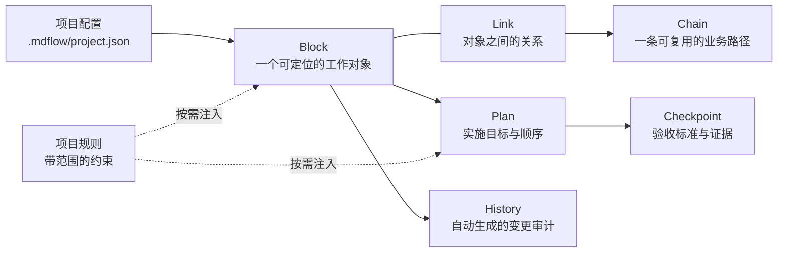

<div align="center">
  
  <h1>mdflow</h1>
  <p><strong>让复杂项目，一眼看清；让每次修改，都有依据。</strong></p>
  <p><code>macOS 14+</code>&nbsp;&nbsp;·&nbsp;&nbsp;<code>MIT</code>&nbsp;&nbsp;·&nbsp;&nbsp;<code>v0.1.0</code></p>
</div>

> mdflow 是一个面向真实开发的项目记忆层：人从 Canvas 看全局，AI 通过内置 MCP 读取当前任务所需的最小上下文，所有变更、验证与历史都回到同一份项目事实。

## 先看真实操作

<p align="center">
  
</p>

<p align="center"><sub>顶部筛选 → Canvas 动态重排 → 选择影响路径 → 查看验证依据。页面内直接播放，不需要另外下载素材。</sub></p>

## 三个核心痛点

### 1. 面向人：项目变大后，仍然一眼看清

代码、功能、依赖和进度通常散落在目录、Issue 和长文档里。mdflow 把它们投影到一个可缩放 Canvas：左侧看工作分组与进度，中间看关系和影响范围，顶部勾选类别后视图会自然重排。你不需要先读完整套文档，打开项目就能知道现在发生了什么。

<p align="center">
  
</p>

<p align="center"><sub>全局视图：一个项目快照，同时呈现结构、状态、路径和待验证项。</sub></p>

### 2. 面向 AI：只读当前任务真正需要的内容

mdflow 内置 MCP。AI 不再反复扫描几百行 Markdown，而是先拿到范围和覆盖摘要，再按任务展开相关规则、工作项、依赖、最近变化和验证依据。默认返回短而有顺序的 Markdown；只有 AI 明确要求精确字段时才返回 JSON。

<table>
  <tr>
    <td width="55%" valign="top">
      
      <p align="center"><sub>内置 MCP：从工具入口接入当前项目。</sub></p>
    </td>
    <td width="45%" valign="top">
      
      <p align="center"><sub>项目路径和实时数据绑定，变化自动同步。</sub></p>
    </td>
  </tr>
</table>

### 3. 面向长期维护：开发不会越走越偏

每次重要修改都留下“改了什么、为什么改、怎样验证”。路径视图显示影响范围，验证详情显示标准与证据；没有依据的工作不会被悄悄算作完成，代码和项目说明也不会各自演化成两套真相。

<p align="center">
  
</p>

<p align="center"><sub>路径影响：把一次改动会经过的功能和交付边界连成可追溯的路线。</sub></p>

<p align="center">
  
</p>

<p align="center"><sub>验证详情：状态、验收标准、命令结果和历史记录集中展示。</sub></p>

## 核心模型：六个概念，各司其职



### 项目配置（Project configuration）

项目根目录只需要一个 `.mdflow/project.json` 作为身份描述，图谱事实保存在 `.mdflow/mdflow.sqlite`。App 和 MCP 使用同一份项目描述与数据库；每次 MCP 调用都明确 `projectRoot`，因此不会把一个项目的上下文写进另一个项目。

### Block：最小的可追踪工作对象

Block 可以代表一个界面、服务、数据表、接口、测试目标或其他需要定位的工作。它可以独立存在，也可以被多个 Chain 和 Plan 引用；Block 不是 Chain 的“所有者”。只有当需求、Plan、Chain gate 或明确的验证要求出现时，才为它建立 checkpoint。

### Link：对象之间的关系

Link 表示 `depends_on`、`calls`、`reads`、`writes`、`flows_to` 等关系。它是全局图谱中的连接，不属于某一条 Chain；因此一条关系可以被多个路径和计划复用。

### Chain：把关系整合成一条路径

Chain 描述一个可复用的用户流程或系统路径，例如“登录 → 会话 → 首页”。它负责说明经过哪些对象、哪些关系需要整合，但不负责管理 Block，也不是 Plan 的唯一入口。

### Plan：实施目标、工作范围与顺序

Plan 可以直接引用 Block，也可以引用 Chain 的整合范围。它的进度不是只看某条路径，而是同时计算：

```text
Direct Block Changes
+ Chain Changes
+ Link Changes
+ Chain integration gates
+ Plan acceptance gate
```

点击 Plan 后，应能看到每个直接工作对象为什么需要修改、当前证据是什么、哪些路径被它阻塞，以及最终整体验收是否通过。

### Checkpoint：可验证的完成条件

Checkpoint 不是描述性备注，而是一条验收契约：目标、标准、状态、证据和所需证据等级。它可以绑定 Block、Link、Chain 或 Plan；只有有匹配证据的 `passed` 才能作为完成依据，`partial_pass`、`failed` 和 `pending` 都会继续留在视图中。

### History：自动生成的审计轨迹

每次 MCP 原子写入都会生成 History，记录 revision、changedFields、before/after、受影响引用以及关联的 Plan/路径。History 只回答“发生了什么”，不取代实体正文，也不取代 Checkpoint 的验收证据。

### 项目规则：有范围的约束，不占 Canvas

规则是项目级或领域级的约束，例如 UI 规范、数据安全要求或发布限制。规则标明作用范围，只在 AI 请求相关任务上下文时按需附上；它不是 Block、Chain、Plan，也不会被重复塞进每次回复。

## 正常开发需要手动打开 MCP 吗？

不需要。一次配置后，日常流程是：

1. 打开 mdflow App，选择项目。
2. 进入设置，点击 **一键安装**；App 会注册本地 marketplace 并安装 mdflow 插件。
3. 在 Codex 中开始一个新任务；Codex 会根据插件内的 `.mcp.json` 按需自动拉起 mdflow MCP Server。
4. 保持 App 打开即可看到图谱实时变化；即使关闭 App，插件仍可以对同一项目执行读取和写入。

`npm run mcp` 只用于 mdflow 贡献者调试 MCP Server，不是普通用户的启动步骤。安装状态显示“已安装；新任务中即可使用”时，已有任务重新开一个任务即可加载插件。

## AI 的标准工作闭环

```text
context_for_task
  → plan_context / entity_open
  → 小范围 MCP 写入
  → 读取回执与 changes_since
  → graph_validate
```

读取默认是 Markdown-first，避免 JSON 重复占用上下文；写入、回读和校验都带 revision，旧上下文写入会被拒绝，而不是静默覆盖最新事实。

## 一个可复核的对比

同一任务、同一组事实的确定性基线（`llmClaim=false`）：

| 上下文方式 | 读取量 | 事实回忆 |
| --- | ---: | --- |
| **mdflow 任务切片** | **2,344 tokens** | **13 / 13 · 0 errors** |
| 只读完整 Markdown | 3,321 tokens | 13 / 13 · 0 errors |
| **差异** | **−29.4%** | — |

这是一组记录过的受控 fixture，用来展示“只读需要的内容”的方向，不是对所有模型、项目或网络环境的速度承诺。

## 本地运行（仅贡献者）

```bash
swift build --package-path apps/desktop
swift run --package-path apps/desktop mdflow-desktop

npm install
npm run mcp
```

## 当前状态

当前演示项目包含 `27` 项工作、`6` 条路径、`26 / 27` 已验证。完整源码、插件和 `.mdflow` 图谱都在仓库中；README 内的 GIF 与截图会随页面直接展示，不需要另外下载素材。

## License

[MIT](LICENSE)
