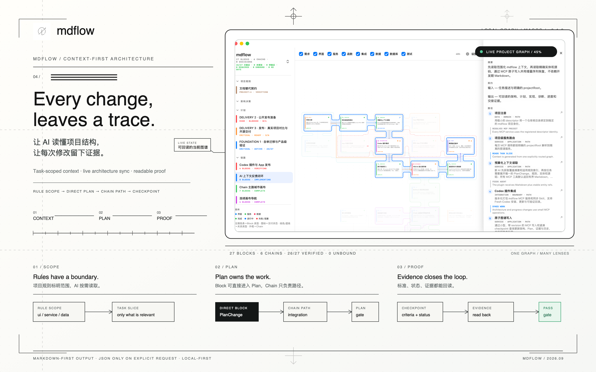

<div align="center">
  
  <h1>mdflow</h1>
  <p><strong>Complex projects, made clear.</strong><br />复杂项目，一眼看懂。</p>
  <p><code>macOS 14+</code>&nbsp;&nbsp;·&nbsp;&nbsp;<code>v0.1.0</code>&nbsp;&nbsp;·&nbsp;&nbsp;<code>open source</code></p>
</div>

<p align="center">
  
</p>

从第一个想法到最后一次交付，mdflow 把项目的结构、进度和依据放在同一个实时视图里。你看得懂现在发生了什么，AI 也只读取它真正需要的内容。

## Three problems. One clear answer.

| 谁在使用 | 常见问题 | mdflow 的答案 |
| --- | --- | --- |
| **用户 / 团队** | 项目越做越大，没人能一眼说清全局；进度更新总是滞后。 | 一个 Canvas 看清功能、依赖和进度；文件或任务变化后自动同步。 |
| **AI / 开发者** | 每次都要把整篇说明重新塞进上下文，token 浪费在重复阅读上。 | 内置 MCP，按当前任务读取一小段相关上下文；默认返回简洁 Markdown，需要精确字段时再请求 JSON。 |
| **长期维护** | 代码已经变了，设计说明还停在过去；项目慢慢偏离最初目标。 | 修改、历史与验证结果一起留下，可回看“改了什么、为什么改、是否可以交付”。 |

## See it, use it, trust it

<p align="center">
  <video src="assets/mdflow-demo.mov" autoplay loop muted playsinline controls poster="assets/mdflow-release-2880x1800.png" width="100%"></video>
</p>

<p align="center"><sub>真实 App 操作录屏 · 原始 2880×1800 · 原文件未重新编码；如浏览器不支持自动播放，可<a href="assets/mdflow-demo.mov">直接打开视频</a>。</sub></p>

### 01 · See the whole project

打开项目，先看到的是全局：功能在哪里、它们如何连接、目前完成到哪一步。筛选顶部类别时，Canvas 会自然重排，让视图始终保持可读。

### 02 · Give AI less to read, not less to understand

mdflow 自带 MCP。AI 不必反复扫描几百行开发 Markdown，而是请求当前任务的相关切片：必要的规则、工作项、依赖、最近变化和验证依据。信息更短，顺序更清楚，遗漏更容易被发现。

### 03 · Keep the project true

每次重要修改都能回到同一条记录：发生了什么、影响了什么、怎样验证。结构不会因为多人协作或多轮 AI 修改而悄悄漂移；未安排、未验证或缺少依据的工作会留在视图里，而不是消失在长文档中。

## The simple mental model

```text
看全局  →  定计划  →  修改实现  →  验证交付
  ↑                                      ↓
  └────────────── 实时同步与历史记录 ──────┘
```

对用户，这是一个始终清楚的项目地图；对开发者，这是一个更短、更稳定的 AI 工作上下文。底层图谱使用 Project rules、Block、Chain、Plan、Link 和 Checkpoint 保存事实，但发布页只需要讲清它们带来的体验。

## A measured advantage

同一任务、同一组事实的受控基线（`llmClaim=false`）：

| 上下文方式 | 读取量 | 事实回忆 |
| --- | ---: | --- |
| **mdflow task slice** | **2,344 tokens** | **13 / 13 · 0 errors** |
| Markdown-first | 3,321 tokens | 13 / 13 · 0 errors |
| **差异** | **−29.4%** | — |

这是一个记录过的确定性 fixture，用来展示“只读需要的内容”的方向，不是对所有模型、项目或网络环境的速度承诺。

## Built for developers

- **Local-first** — 项目数据保存在自己的 `.mdflow` GraphStore，不依赖云端账户。
- **Markdown-first MCP** — 工具返回适合人和 AI 快速阅读的 Markdown；只有显式请求时才展开 JSON。
- **Read back after every write** — 写入有回执，变更可追踪，图谱可验证。
- **Public docs stay public** — README、发布说明和长篇设计稿仍然可以用 Markdown；开发上下文由 mdflow 负责压缩、定位和同步。

### Run locally

```bash
swift build --package-path apps/desktop
swift run --package-path apps/desktop mdflow-desktop

npm install
npm run mcp
```

打开一个包含 `.mdflow/project.json` 的项目目录即可开始。MCP 插件位于 `plugins/mdflow/`，会把请求路由到当前项目，而不是另一个工作区。

## Release kit

- [发布主视觉 · 2880×1800 PNG](assets/mdflow-release-2880x1800.png)
- [原始演示视频 · 2880×1800 MOV](assets/mdflow-demo.mov)

`v0.1.0` 是当前 macOS release candidate：**27 项工作、6 条执行路径、26 / 27 已验证**。最后一个视觉发布检查点仍保持可复核状态，不会为了好看而隐藏未完成项。

<div align="center"><sub>See the system · Work with AI · Stay true</sub></div>
