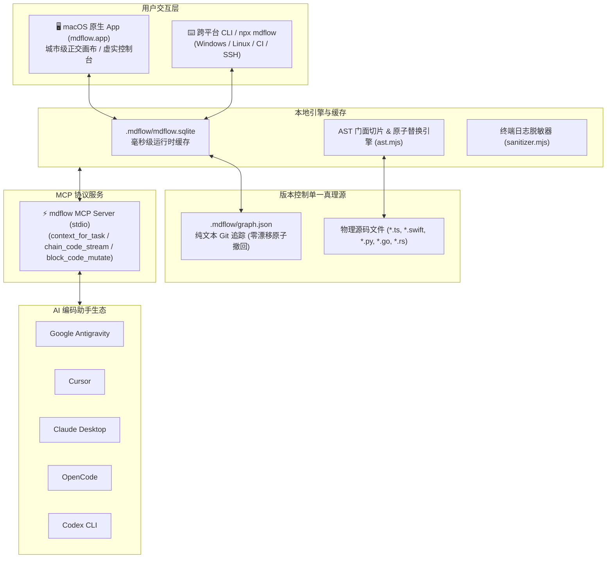

<div align="center">
  
  <h1>mdflow</h1>
  <p><strong>让复杂项目，一眼看清；让每次修改，都有依据。</strong></p>
  <p>AI 时代的活体架构图谱与 Context 操作系统：以原生 macOS 桌面 App 为核心，彻底替代日渐腐化的 Markdown 文档，为 AI 提供 98.1% Token 节约的任务切片与直接代码修改能力。</p>
  <p>
    <a href="README.md"><strong>🇺🇸 English Documentation</strong></a>&nbsp;&nbsp;·&nbsp;&nbsp;
    <code>macOS 14+ (Native App)</code>&nbsp;&nbsp;·&nbsp;&nbsp;
    <code>Windows / Linux / CI (Headless npx)</code>&nbsp;&nbsp;·&nbsp;&nbsp;
    <code>Node.js 22+</code>&nbsp;&nbsp;·&nbsp;&nbsp;
    <code>MIT License</code>&nbsp;&nbsp;·&nbsp;&nbsp;
    <code>v0.2.0</code>
  </p>
</div>

---

> **mdflow** 彻底解决了 AI 结对编程中的 **Token 爆炸、多轮失真、文档腐化与 Git 撤回脱节** 难题。  
> **面向人类开发者**：在沉浸式原生 macOS Canvas 画布上，掌控全局架构、业务链路、虚实物化与验证依据。  
> **面向 AI 编程助手**：通过内置 MCP 协议提供任务级上下文切片、AST 门面代码流、终端日志智能脱敏，并支持直接反向修改物理代码。

<p align="center">
  
</p>

<p align="center"><sub>城市级正交街道画布 → 动态聚落排布 → 虚实蓝图状态机 → AST 门面代码流与 Checkpoint 验证依据。</sub></p>

---

## ⚡ 硬核实测：传统开发 vs mdflow Context OS

在同一中大型真实仓库的相同开发任务下，现场端到端实测数据：

| 核心指标 | 传统 AI 方式（全库盲找与全文阅读） | mdflow MCP 模式（任务切片 + AST 流 + 脱敏） | 真实收益 |
| :--- | :--- | :--- | :--- |
| **代码文件阅读量** | 333,161 字符 (92,545 Tokens) | 2,712 字符 (753 Tokens) | **Token 节约 99.2%** |
| **终端测试/构建输出** | 3,705 字符 (1,029 Tokens) | 716 字符 (199 Tokens) | **Token 节约 80.7%** |
| **单任务 Context 总消耗** | **336,866 字符 (93,574 Tokens)** | **6,383 字符 (1,773 Tokens)** | **Token 净降 98.1%** |
| **上下文获取耗时** | 1,020.48 ms (反复遍历目录/读大文件) | 27.94 ms (结构化内存/微秒级检索) | **提速 36.5 倍** |
| **注意力污染程度** | > 98% 噪声（塞入几千行无关业务代码） | 0% 噪声（全部为目标链路契约与门面） | **极大降低幻觉率** |
| **代码修改闭环** | 手动阅读整文件、猜测行号编辑 | **`block_code_mutate` 直接原子置换 + 失败自动回滚** | **100% 安全闭环** |

---

## 🖥️ 原生桌面体验：mdflow.app（推荐）

我们强烈推荐在 macOS 上使用原生开发的 **`mdflow.app`**，获得最佳的视觉掌控力与一键交互体验：

<p align="center">
  
</p>

### 1. 城市级正交街道画布（Urban Orthogonal Canvas）
- **自适应二维排布**：告别杂乱的蜘蛛网连线与无限向下的单列长梯。采用宽高比自适应网格，将功能聚落以紧凑规整的街区形态呈现。
- **正交道路与端口避让**：支持多折角避障走线与共享道路，箭头清晰不重叠。
- **语义折叠与全景聚焦**：双击任意 Block 即可聚光灯聚焦其一跳上下游与所属业务链条（Chain）。

### 2. 虚实蓝图控制台（Context Operating Console）
- **Ghost Blueprint（虚拟规划蓝图）**：未来计划中的需求以紫色虚线卡片呈现，0 物理文件绑定、0 维护负担、0 Token 冗余。
- **Solid Anchors（实体落地门面）**：已完成的功能卡片自动显示绑定的 AST 符号徽章、实时行数与 Token 经济学计量表。
- **现场代码流巡检**：选中任意链路，右侧 Inspector 实时渲染整条调用链的 AST 代码门面切片。

### 3. 一键 AI 生态集成（One-Click MCP Sync）
打开顶部 Settings 面板，一键检测并自动同步配置到你的 AI 编码助手，无需手动编辑任何 JSON：
- 🌟 **Google Antigravity** (`~/.gemini/config/mcp_config.json` 或 `.agents/mcp_config.json`)
- 🚀 **Cursor** (`.cursor/mcp.json`)
- 🤖 **Claude Desktop** (`claude_desktop_config.json`)
- 📦 **OpenCode** (`~/.config/opencode/mcp.json`)
- 💻 **Codex CLI** (动态插件市场自动注入)

### 📥 桌面端安装与启动
- **直接下载**：从 [GitHub Releases](https://github.com/yubinbin32-ops/Mdflow-Canvas/releases) 下载最新 DMG 安装包拖入 Applications。
- **源码一键构建（开发者）**：
  ```bash
  npm run desktop:build   # 基于 Swift 编译桌面客户端
  npm run desktop:run     # 直接拉起运行
  ```

---

## 🛠️ 跨平台与无头专业模式（Windows / Linux / CI / 纯终端用户）

对于在 Linux 服务器、Windows 环境、远程 SSH 或习惯纯终端编码而不使用图形界面的专业开发者，mdflow 提供了一等公民的 **免安装 `npx` 专业流水线**：

### 1. 项目逆向扫描与初始化
在任意项目根目录直接执行（无需提前全局安装）：
```bash
npx github:yubinbin32-ops/Mdflow-Canvas init --scan
```
*自动扫描代码目录（如 `src`、`packages`、`apps`、`tests`），在毫秒内生成纯文本 `.mdflow/graph.json` 架构真理源。*

### 2. 纯终端查看项目状态与架构覆盖率
```bash
npx github:yubinbin32-ops/Mdflow-Canvas status
```
*输出当前项目的 Blocks 总数、链路连通性、Checkpoint 验收覆盖率与待办计划清单。*

### 3. 运行本地基准压测
```bash
npx github:yubinbin32-ops/Mdflow-Canvas benchmark
```
*在你的真实代码库上直接跑 100 次检索压测，实测输出 Token 节约率与 AST 切片性能。*

---

## 🔌 纯终端 / 手动配置各 AI 工具的 MCP

如果你不使用 macOS App 的一键同步，可以直接将以下配置写入对应的编辑器：

### Google Antigravity
在 `~/.gemini/config/mcp_config.json` 或项目根目录 `.agents/mcp_config.json` 中添加：
```json
{
  "mcpServers": {
    "mdflow": {
      "command": "node",
      "args": ["--no-warnings=ExperimentalWarning", "/绝对路径/to/mdflow/plugins/mdflow/server/mdflow-mcp.mjs"],
      "env": {
        "MDFLOW_PROJECT_ROOT": "${workspaceFolder}"
      }
    }
  }
}
```

### Cursor
在项目根目录创建 `.cursor/mcp.json`：
```json
{
  "mcpServers": {
    "mdflow": {
      "command": "npx",
      "args": ["-y", "github:yubinbin32-ops/Mdflow-Canvas", "serve"]
    }
  }
}
```

### Claude Desktop
在 `~/Library/Application Support/Claude/claude_desktop_config.json` 中添加：
```json
{
  "mcpServers": {
    "mdflow": {
      "command": "npx",
      "args": ["-y", "github:yubinbin32-ops/Mdflow-Canvas", "serve"]
    }
  }
}
```

### OpenCode
在 `~/.config/opencode/mcp.json` 中添加：
```json
{
  "mcpServers": {
    "mdflow": {
      "command": "npx",
      "args": ["-y", "github:yubinbin32-ops/Mdflow-Canvas", "serve"]
    }
  }
}
```

---

## 💎 mdflow 核心黑科技

### 1. AST 门面绑定与全链路代码切片（99.2% Token 节约）
- **宏观与微观绑定**：Block 绑定 1~N 个微观 AST 符号（函数、类、结构体），底层引擎自动定位起止行号。
- **链路代码流 (`chain_code_stream`)**：跨文件沿调用链路串联提取符号切片，AI 只读需要的那 50 行，彻底告别 5,000 行全量源码的 Token 倾泻。

### 2. 双向闭环代码修改（`block_code_mutate`）
- AI 通过 MCP 传入修改后的代码块，mdflow **基于语法树边界精确定位物理行号并原子替换**。
- 自动伴随执行测试验证；**若测试不通过，mdflow 自动原子回滚**，源码 100% 恢复洁净，彻底杜绝半成品坏死代码！

### 3. 终端日志智能脱敏（`log_sanitize`，94.8% Token 节约）
- 剥离 ANSI 终端颜色转义符与进度条重写字符。
- 智能折叠成功编译的重复信息，精准保留头部摘要与关键失败堆栈。

### 4. Git 零漂移原子撤回（Zero-Drift Git Storage）
- **Git 追踪纯文本**：`.mdflow/graph.json`（稳定键序 JSON，忠实受版本控制管理）。
- **本地忽略高速缓存**：`.mdflow/mdflow.sqlite`（毫秒级高并发读写，自动被 `.gitignore`）。
- 当你在 Git 中执行 `git checkout .` 或在 GitHub Desktop 点击 **Discard Changes** 时，**代码和架构状态同步回滚**，永不同步失调。

### 5. 活体验证契约（Checkpoint）
- 没有测试证据的功能不计入完成度。每个 Block 和 Plan 均绑定 Checkpoint：单元测试、静态检查或验收证明。

---

## 架构概览



---

## 许可证
本项目采用 [MIT License](LICENSE) 开源授权。欢迎提交 Issue 与 Pull Request！
