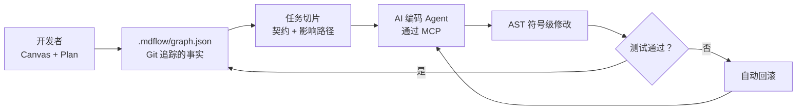
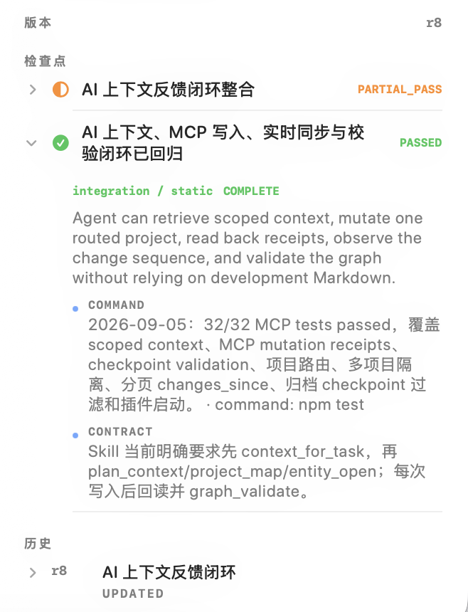

<div align="center">
  
  <h1>mdflow</h1>
  <p><strong>面向 AI 编码 Agent 的 Context 操作系统。</strong></p>
  <p>让人看清整个系统，让 Agent 只读取相关代码，<br />再通过可验证、可回滚的边界直接完成修改。</p>
  <p>
    <a href="README.md">English</a> ·
    <a href="https://dashend.cn">官方网站</a> ·
    <a href="https://glama.ai/mcp/servers/yubinbin32-ops/Mdflow-Canvas">MCP 目录</a> ·
    <a href="https://github.com/yubinbin32-ops/Mdflow-Canvas/releases/latest">下载 macOS 客户端</a>
  </p>
  <p>
    <a href="https://github.com/yubinbin32-ops/Mdflow-Canvas/releases"></a>
    <a href="https://github.com/yubinbin32-ops/Mdflow-Canvas/actions/workflows/release.yml"></a>
    <a href="LICENSE"></a>
    
    
  </p>
</div>

<p align="center">
  
</p>

<p align="center"><sub>筛选架构 → 追踪影响路径 → 查看精确代码与验证证据。</sub></p>

## 它解决什么问题

AI 编码 Agent 会反复扫描同一个仓库，为理解一个函数读取整个文件，把终端噪声塞进上下文，并在新会话里丢失架构决策。Markdown 规范最初有用，随后很容易与代码脱节。

mdflow 把 Git 可追踪的架构图谱放在源码旁边。它的 MCP 服务把图谱转成每个任务需要的窄而准确的上下文，还能在 AST 符号边界内修改代码、运行验证，并在失败时自动恢复原文件。

| 面向开发者 | 面向 AI Agent |
| --- | --- |
| 原生 Canvas 统一展示架构、依赖、计划、进度与证据 | 读取任务切片，避免全仓库盲扫 |
| 用 Ghost Blueprint 规划未来，用 Solid Anchor 绑定已有代码 | 沿完整执行链提取 AST 符号切片 |
| 修改前先查看影响路径 | 原子修改符号，验证失败自动回滚 |
| Git 原生历史：代码和架构一起演进 | 压缩终端输出，保留真正有用的失败信息 |

## 在你的仓库里试一次

需要 Node.js 22 或更高版本，无需全局安装。

```bash
cd your-project
npx -y github:yubinbin32-ops/Mdflow-Canvas init --scan
npx -y github:yubinbin32-ops/Mdflow-Canvas status
npx -y github:yubinbin32-ops/Mdflow-Canvas setup
```

macOS 14+ 用户可以从 [GitHub Releases](https://github.com/yubinbin32-ops/Mdflow-Canvas/releases/latest) 下载原生客户端，在图形界面中探索架构、聚焦依赖、检查代码流并配置 Agent。CLI 与 MCP 服务也支持 Windows、Linux、CI 和远程服务器。

## 一个完整闭环



运行时使用本地 SQLite 缓存加速读取，持久化真理源是键序稳定的纯文本 JSON。因此 Git checkout 或 discard 可以同时恢复代码与架构状态。

## 在 mdflow 自身上的实测

运行 `npm run benchmark` 可以在本地复现。数据会随仓库和任务变化；下表来自当前 mdflow 代码库。

| 操作 | 传统方式 | mdflow | 实测结果 |
| --- | ---: | ---: | ---: |
| 单任务上下文 | 112,738 tokens | 1,197 tokens | **减少 98.9%** |
| 四模块跨文件代码链 | 84,227 tokens | 654 tokens | **减少 99.2%** |
| 构建与测试日志 | 4,042 tokens | 212 tokens | **减少 94.8%** |
| 结构化上下文检索 | 反复扫描文件 | P50 3.11 ms | 本地索引查询 |

基准还会检查目标模块命中、关联拓扑捕获、无关模块隔离、Checkpoint 固化、Change Set 撤回和 Git 图谱同步。

## 核心区别

### 架构可以先于代码存在

未来功能可以先作为 **Ghost Blueprint** 存在，不需要伪造文件绑定。代码落地后，Block 会成为连接真实 AST 符号的 **Solid Anchor**。同一个对象从意图一路演进到代码与证据。

### 在符号边界提供代码上下文

`chain_code_stream` 沿执行路径跨文件提取相关函数、类和契约。Agent 看到参与当前任务的代码，无需读取每个文件的每一行。

### 在验证边界内修改代码

`block_code_mutate` 定位 Block 绑定的符号，原子替换实现，运行配置好的验证命令，并在验证失败时恢复原文件。

### 让证据成为架构的一部分

Plan 和 Block 可以要求由测试、静态检查或评审回执支持的 Checkpoint。完成状态由证据推动，而不是依赖聊天中的口头声明。

### 为 Agent 压缩终端上下文

`log_sanitize` 去除 ANSI 控制符、进度动画重写和重复的成功输出，同时保留失败摘要与关键堆栈。

## 原生 macOS Canvas

<p align="center">
  
</p>

- 紧凑正交路由让大型依赖图保持可读。
- 双击聚焦一跳依赖和相关 Chain。
- Inspector 展示 AST 绑定、代码流、计划、进度和 Checkpoint 证据。
- Settings 可以配置 Google Antigravity、Cursor、Claude Desktop、OpenCode 和 Codex 工作流。

<table>
  <tr>
    <td width="50%"></td>
    <td width="50%"></td>
  </tr>
  <tr>
    <td align="center"><sub>修改前追踪完整影响路径。</sub></td>
    <td align="center"><sub>查看完成状态背后的验证证据。</sub></td>
  </tr>
</table>

## 连接 MCP 客户端

桌面 App 可以自动写入受支持的配置。手动配置时，让客户端启动仓库内置服务：

```json
{
  "mcpServers": {
    "mdflow": {
      "command": "npx",
      "args": ["-y", "github:yubinbin32-ops/Mdflow-Canvas", "serve"]
    }
  }
}
```

Cursor、Claude Desktop、OpenCode 以及其他 stdio MCP 客户端都使用这一标准结构。Google Antigravity 可以直接指向打包后的服务，并将 `MDFLOW_PROJECT_ROOT` 设置为工作区目录。

## 本地开发

```bash
npm ci
npm test                 # 17 项测试
npm run benchmark        # 可复现的 Context / AST / 日志基准
npm run plugin:build     # 重新打包 MCP 服务
npm run desktop:build    # 构建 Swift macOS App
```

## 项目状态

mdflow 仍处于开源早期阶段，图谱格式和 MCP 接口会继续演进。原生 App 当前面向 macOS 14+，跨平台 CLI 与服务需要 Node.js 22+。欢迎提交 Issue、可复现的基准结果和范围清晰的 Pull Request。

## 许可证

[MIT](LICENSE) © mdflow contributors
