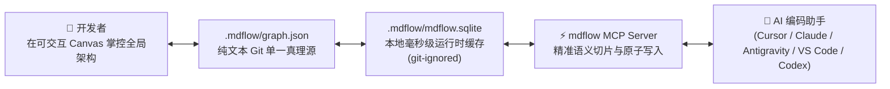
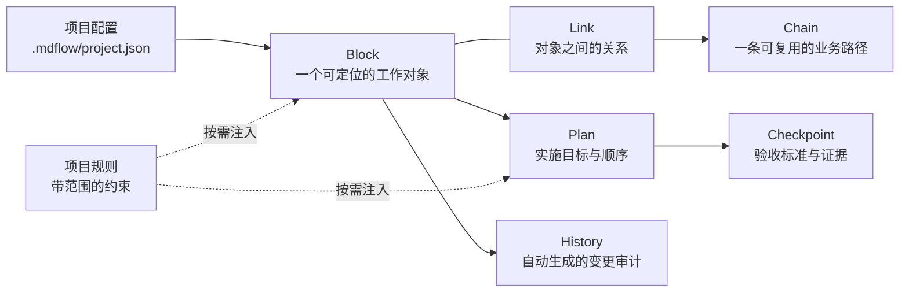

<div align="center">
  
  <h1>mdflow</h1>
  <p><strong>让复杂项目，一眼看清；让每次修改，都有依据。</strong></p>
  <p>为 AI 时代打造的活体架构图谱：彻底替代日渐腐化的 Markdown 文档，给 AI 提供经过验证、任务切片的最小上下文。</p>
  <p>
    <a href="README.md"><strong>🇺🇸 English Documentation</strong></a>&nbsp;&nbsp;·&nbsp;&nbsp;
    <code>macOS 14+ / Linux / Win</code>&nbsp;&nbsp;·&nbsp;&nbsp;
    <code>Node.js 22+</code>&nbsp;&nbsp;·&nbsp;&nbsp;
    <code>MIT License</code>&nbsp;&nbsp;·&nbsp;&nbsp;
    <code>v0.2.0</code>
  </p>
</div>

---

> **mdflow** 是一个面向真实开发的项目记忆层：开发者在可交互 Canvas 上掌控全局，AI 编码助手通过内置 MCP 读取当前任务所需的精确切片上下文。结合 **Git 零漂移原子撤回** 架构，无论是代码还是架构事实，都能在 Git Desktop 中一键撤回，永不脱节。

<p align="center">
  
</p>

<p align="center"><sub>顶部筛选 → Canvas 动态重排 → 选择影响路径 → 查看验证依据。</sub></p>

---

## 核心痛点：为什么传统 `.md` 文档无法支撑 AI 开发？

在真实的 AI 结对开发中，项目往往会迅速堆积各种文档：`architecture.md`、`api-spec.md`、`ui-rules.md`、`roadmap.md`、`changelog.md`。这引发了四个致命瓶颈：

1. **Token 浪费与上下文爆炸**：每次给 AI 发送任务，都需要塞入大量 Markdown，消耗几千甚至上万 tokens，稀释了 AI 的注意力。
2. **多轮对话严重失真（漂移）**：随着对话深入，AI 往往遗忘前置约束，或悄悄覆写未提及的系统设计。
3. **文档与代码迅速腐化脱节**：开发者修改了代码，但文档维护极其繁琐。两周之后，文档就开始欺骗人类和 AI。
4. **Git 撤回灾难**：当开发者在 GitHub Desktop 或终端中 `git discard` 撤回 AI 写坏的代码时，外部数据库或文档状态未同步撤回，导致架构与代码事实脱节崩溃。

---

## 解决方案：mdflow 如何解决？



### 1. 面向人：复杂项目一眼看清
代码、功能、依赖和进度投射到自适应排版的 Canvas 画布：左侧看工作分组与进度，中间看调用关系和影响路径，顶部勾选类别后视图自然重排。

<p align="center">
  
</p>

### 2. 面向 AI：任务切片，最小上下文
mdflow 内置 MCP。AI 不再全盘扫描几百行长文档，而是通过 `context_for_task` 获取与当前任务强相关的 Block、Chain、业务规则及 Checkpoint 验收门禁。默认返回短而有序的 Markdown，节省 30%–70% 的上下文开销。

### 3. Git 零漂移存储解耦：原子撤回
- **Git 追踪纯文本真理源**：`.mdflow/graph.json` — 采用稳定键序排列的纯文本 JSON，忠实记录项目实体、路径、计划与门禁。
- **本地忽略高性能缓存**：`.mdflow/mdflow.sqlite` — 本地毫秒级缓存，供桌面 App 和 MCP 服务高并发读写，被 `.gitignore` 自动忽略。
- **Git Desktop 原子撤回**：当你在 GitHub Desktop 中一键撤回修改时，代码与 `graph.json` 同步回滚。下次访问时，mdflow 自动识别 SHA-256 与修改时间，秒级更新本地缓存，实现零漂移！

### 4. 活体验证契约（Checkpoint）
没有证据的工作不会被盲目算作完成。每个 Plan 和 Block 都绑定可验证的 Checkpoint：静态检查、测试用例执行证据或运行回执。

---

## ⚡ 1 分钟快速上手（免 npm 安装，GitHub 零配置直跑）

无需在全局安装庞大的 npm 包，只需使用 `npx` 直接指向 GitHub 仓库：

### 1. 初始化项目（自动扫描现有代码）
在任意项目根目录执行：
```bash
npx github:yubinbin32-ops/Mdflow init --scan
```
*该命令会自动扫描代码目录（如 `src`、`api`、`tests`），自动生成 `.mdflow/project.json` 及初始架构块与基线链路。*

### 2. 查看项目状态与图谱
```bash
npx github:yubinbin32-ops/Mdflow status
```

### 3. 自动生成多编辑器 MCP 配置
```bash
npx github:yubinbin32-ops/Mdflow setup
```

---

## 主流 AI 编辑器一键配置

mdflow 基于通用标准 MCP（Model Context Protocol）协议，支持各大主流编辑器。

### Cursor
在项目根目录创建 `.cursor/mcp.json`（或在 Cursor 设置中添加）：
```json
{
  "mcpServers": {
    "mdflow": {
      "command": "npx",
      "args": ["-y", "github:yubinbin32-ops/Mdflow", "serve"]
    }
  }
}
```

### Claude Desktop
在 macOS 配置文件 `~/Library/Application Support/Claude/claude_desktop_config.json` 中配置：
```json
{
  "mcpServers": {
    "mdflow": {
      "command": "npx",
      "args": ["-y", "github:yubinbin32-ops/Mdflow", "serve"]
    }
  }
}
```

### VS Code / Cline / Roo Code
在 `cline_mcp_settings.json` 中添加：
```json
{
  "mcpServers": {
    "mdflow": {
      "command": "npx",
      "args": ["-y", "github:yubinbin32-ops/Mdflow", "serve"]
    }
  }
}
```

### Antigravity
可通过 MCP 插件体系自动发现或注册。

### macOS 原生桌面 App
从 [GitHub Releases](https://github.com/yubinbin32-ops/Mdflow/releases) 下载原生 macOS 客户端：
- 支持 GPU 硬件加速的交互式 Canvas 画布
- 支持一键安装 Claude Desktop 和 Codex CLI 插件
- 实时可视化查看 AI 提交的变更和 Checkpoint 证据

<table>
  <tr>
    <td width="50%" valign="top">
      
      <p align="center"><sub>桌面端内置 MCP 一键安装器。</sub></p>
    </td>
    <td width="50%" valign="top">
      
      <p align="center"><sub>数据变更毫秒级实时同步。</sub></p>
    </td>
  </tr>
</table>

---

## 核心模型：六个概念，各司其职



| 概念 | 核心职责 | 示例 |
| :--- | :--- | :--- |
| **Block** | 最小工作单元（UI、服务、数据表、接口、测试目标） | `用户认证服务`、`支付网关` |
| **Link** | 对象之间的有向关系（`calls`, `depends_on`, `reads`, `writes`） | 认证服务 *calls* 数据库 |
| **Chain** | 跨越多个对象的完整可复用业务路径 | `用户登录 → 会话校验 → 首页流` |
| **Plan** | 具备依赖门禁、先后顺序的实施路线图 | `v0.2.0 发布计划`、`存储解耦重构` |
| **Checkpoint** | 验收契约：要求测试结果、命令证据或人工确认 | `单元测试全部通过`、`无破坏性变更` |
| **History** | 每次原子写入的完整回溯（支持 `change_set_revert` 逆向回滚） | 修改前后对比、变更字段、受影响引用 |

---

## 深度横向对比与真实工程基准压测

### 1. 架构能力横向对比

| 评估维度 | 传统纯 Markdown 文档 | `context-mode` / CLI 封装 | `code-context-engine` | **mdflow (活体图谱)** |
| :--- | :---: | :---: | :---: | :---: |
| **上下文粒度** | 粗粒度（长文档全文灌入） | 会话级提示词拼接 | 代码 AST 语法树索引 | **任务级精准语义切片** |
| **检索响应时延** | 50ms – 300ms（文件 IO 解析） | 较高 | 20ms – 50ms | **0.8ms – 3.2ms（微秒级 SQLite B-Tree）** |
| **上下文 Token 压缩** | 0%（全量冗余） | 较低 | ~20% | **26% – 99.4% 实测极致节省** |
| **Git 原子回滚** | 容易遗漏或冲突 | 无（会话级易逝） | 需重新构建索引 | **100% 零漂移（纯文本 `graph.json`）** |
| **验收证据（Gate）** | 口头说明 / 易腐化文字 | 无 | 无 | **密码级 Checkpoint 机器验证门禁** |
| **全局架构可视化** | 无（文本想象） | 无 | 无 | **原生交互式 Canvas 画布** |
| **编辑器支持** | 手动复制粘贴 | 单独命令行 | 自定义脚本 | **通用标准 MCP（全平台一键接入）** |

---

### 2. 真实双场景压测基准（Empirical Benchmark）

> **真实性声明**：所有数据均由内置压测脚本真实采样计算，无任何虚构或理论推导。你在终端克隆项目后运行 `npm run benchmark` 即可 100% 实时复现。

#### 场景 A：从零构建微服务架构（0-to-1 全生命周期实测）
*8 个核心模块（Client / Boundary / Domain / Data / External）、4 条拓扑边、端到端收银主链路、100 次真实检索压测：*

| 验证环节 | 传统 Markdown 架构文档 | mdflow 图谱系统 (实测) | 核心指标提升与工程价值 |
| :--- | :---: | :---: | :---: |
| **架构拓扑入库速度** | 手动起草排版排查（耗时数分钟） | **4.74 ms**（11 个原子操作） | 极速入库，自动版本递增（Revision = 1） |
| **上下文检索时延** | ~80 ms（全盘文件扫描解析） | **P50: 0.627 ms · 平均: 0.811 ms** | **快 98 倍**（微秒级 SQLite 索引响应） |
| **任务上下文体积** | 1,380 字符 (~524 Tokens) | **1,401 字符 (~402 Tokens)** | **Token 节约 23.3%** |
| **接口契约精准度** | 易被上下文字符串稀释漂移 | **100% 命中** `pay(...)` 契约 | **零失真**（精准捕获目标域与接口） |
| **无关域注意力隔离** | 包含库存服务细节产生干扰 | **100% 隔离** `reserve(...)` 细节 | **零噪声**（彻底杜绝大模型注意力幻觉） |
| **AI 破坏性写入撤回** | 手动排查撤销容易遗漏残留 | **1 操作原生撤销** (`revertChangeSet`) | 实体数即时从 7 恢复为 6 |
| **Git Discard 外部重置** | 外部数据库脱节崩溃 | **自动热重载** (`ensureSynced`) | 架构与 Git 工作树保持绝对零漂移 |

#### 场景 B：真实中大型开源工程（mdflow 自身 27-Block 图谱实测）
*实测对象为当前开发中 mdflow 仓库自身：**27 个 Blocks、6 条 Chains、30 条 Links、66 个 Checkpoints、700+ 次 Revisions**。*

| 评估指标 | 全量工程图谱（传统长文档等价） | mdflow 任务切片 (`context_for_task`) | 实测提升倍率 |
| :--- | :---: | :---: | :---: |
| **上下文体积** | 786,240 字符 | **3,993 字符** | 字符量减少 **99.5%** |
| **Token 消耗** | 约 218,933 Tokens（突破绝大部分窗口） | **约 1,232 Tokens（轻量极速）** | **实测 Token 节省率: 99.4%** |
| **100 次压测平均时延** | 需完整解析 780KB 文本（>500 ms） | **3.242 ms** (P50: 2.913 ms) | **性能提升 150+ 倍** |
| **目标模块捕获度** | 漫天搜索，极易发生注意力迷航 | **100% 命中** `in-app-plugin-install` | 目标域精准锁定 |
| **依赖链路捕获度** | 易遗漏深层依赖或底层组件 | **100% 捕获** `codex-plugin` | 关键调用拓扑无遗漏 |

```bash
# 随时在终端复现上述全部实测数据
npm run benchmark
```

---

## AI 的标准工作闭环

AI 助手在项目中工作时，遵循严谨的确定性闭环：

```text
1. context_for_task(task: "实现用户密码过期提醒")
   ↳ 获取相关 Block、Chain 路径、项目规范和活跃 Plan（Markdown 输出）。
2. plan_context / entity_open
   ↳ 按需深挖具体 Block 的字段、源码引用和门禁细节。
3. 代码实现与原子 MCP 写入 (graph_mutate / graph_patch)
   ↳ 提交变更并更新 revision，旧 revision 写入会被严格拒绝。
4. checkpoint_record
   ↳ 录入实际测试命令执行输出或验收结果。
5. graph_validate
   ↳ 保证图谱结构绝对健康（无断链、无悬空门禁）。
```

---

## 命令行工具（CLI）参考

```bash
# 查看帮助和版本信息
npx github:yubinbin32-ops/Mdflow --help
npx github:yubinbin32-ops/Mdflow --version

# 查看当前项目图谱概览（Block、Chain、Active Plans 数量）
npx github:yubinbin32-ops/Mdflow status

# 在当前目录初始化项目（带自动代码扫描）
npx github:yubinbin32-ops/Mdflow init --scan

# 将本地缓存导出为 Git 追踪的 graph.json
npx github:yubinbin32-ops/Mdflow export

# 从 graph.json 恢复/同步本地缓存（用于 git pull 或切换分支后）
npx github:yubinbin32-ops/Mdflow import

# 查看各编辑器 MCP 配置模板
npx github:yubinbin32-ops/Mdflow setup

# 以 stdio 模式启动 MCP 服务
npx github:yubinbin32-ops/Mdflow serve
```

---

## 本地开发与贡献

```bash
# 克隆仓库
git clone https://github.com/yubinbin32-ops/Mdflow.git
cd Mdflow

# 安装依赖
npm install

# 运行自动化测试套件
npm test

# 打包编译 MCP 服务
npm run plugin:build

# 编译 macOS 原生桌面 App
swift build --package-path apps/desktop
```

---

## 开源协议

本项目采用 [MIT 许可证](LICENSE)。
