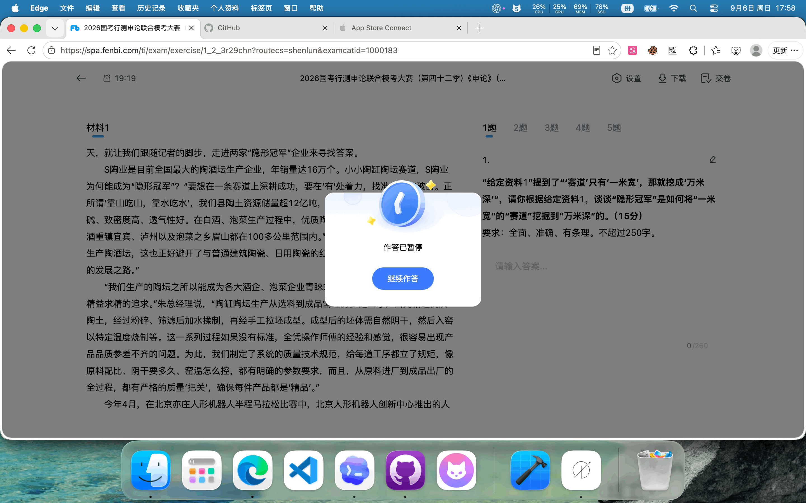

# Express 5.2.1 benchmark sample

This directory is a public, reproducible comparison fixture for mdflow. It records the source snapshot, a Markdown-only control handoff, the benchmark method, and the matching `.mdflow` graph.

## Snapshot

- Upstream: [expressjs/express](https://github.com/expressjs/express)
- Commit: `023767fe9872e029271df1418f73401bff20ff40`
- Version: 5.2.1
- Full test: `npm test` → 1260 passing in the baseline run

The source checkout is kept outside this repository for the benchmark run. The `.mdflow` directory contains the architecture sample that can be copied into the checkout for local exploration.

## What is compared

The benchmark feeds the same three task prompts to two deterministic context assemblers:

1. **mdflow-first** reads the task-scoped graph context, direct Block targets, Chain paths, source refs, and passed checkpoints.
2. **Markdown-first** reads the complete [`markdown-baseline.md`](./markdown-baseline.md) handoff for every task and has no machine-enforced relationships.

The report measures context tokens, characters, assembly time, expected fact recall, and a deterministic rework proxy. It does not claim that a scripted adapter is a human or LLM speed test; a real model run remains a release gate.

## Graph shape

The sample has 11 Blocks, 12 Links, 3 Chains, one Foundation Plan, 11 atomic Block checkpoints, 3 Chain integration gates, and one Plan acceptance gate. Every Block is directly covered by the Plan; Chain membership only integrates paths.

## Visual walkthrough



The two-frame GIF moves from the full architecture canvas to the release Plan inspector. The source frames are [the overview](./mdflow-overview.png) and [the Plan detail](./mdflow-release-plan.png).

## Reproduce

From the mdflow repository:

```bash
node scripts/github-project-benchmark.mjs --write-report=benchmarks/open-source/express/results.json
```

The command expects an Express checkout selected by `MDFLOW_EXPRESS_ROOT` (the local run used a temporary checkout); set it to any matching clone when reproducing the result. The run is read-only against the graph and verifies the graph before writing the report.
