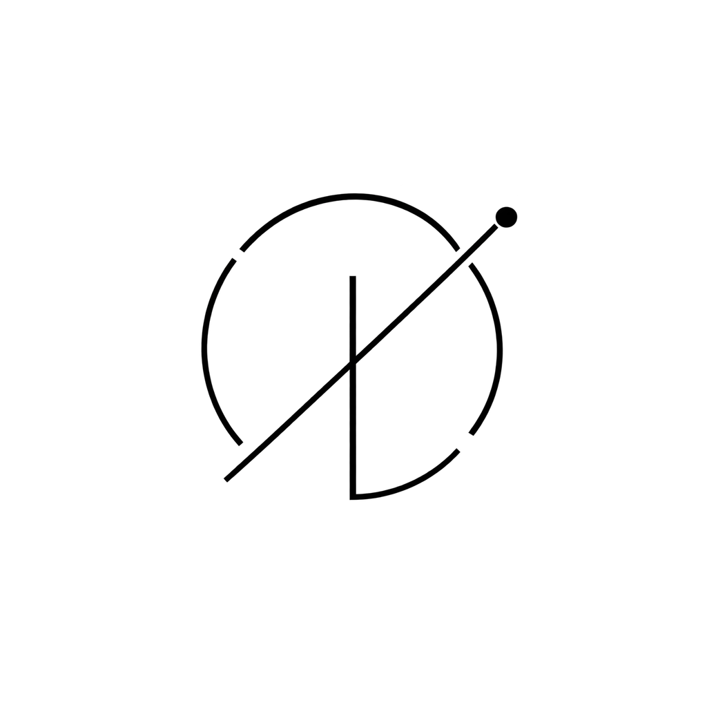

# mdflow



## Architecture memory for coding agents

mdflow turns a requirement into a small, verifiable project context:

```text
context → plan → edit → verify → handoff
```

The graph keeps the relationships that are usually lost between a design note, a code change, and the next agent. The macOS app makes that graph readable; the MCP server makes it queryable and writable; Markdown is the compact projection an agent reads first.

## The short version

AI is good at changing code. It is much less reliable at remembering why a change exists, which Block it affects, whether a path is complete, and what evidence is still missing.

mdflow makes those facts explicit:

| You need to know | mdflow answers with |
| --- | --- |
| What exists? | Blocks, Links, and architecture coverage |
| What changes next? | A Plan with direct Block work and ordered Chain scopes |
| What can be trusted? | Checkpoints with criteria, status, and evidence |
| What was missed? | Standalone, unplanned, checkpoint-free, and required-missing summaries |
| What should the AI read? | A bounded Markdown context pack, with JSON only on request |

## The working loop

1. **Read context.** `context_for_task` returns coverage, applicable rule indexes, and stable refs before it returns detail.
2. **Open the work.** `plan_context` shows Direct Block Work, Chain integration, Link changes, and Plan acceptance in a fixed order.
3. **Make the change.** Code and graph changes share a revision; a Chain is a path, not the owner of its Blocks.
4. **Record proof.** Checkpoints are demand-driven. A discovery Block may have no checkpoint until a requirement, Plan, gate, or explicit verification asks for one.
5. **Resume cleanly.** `changes_since` returns the compact receipt needed by the next agent instead of replaying the whole project document.

## The model in one screen

| Object | Meaning | What it is not |
| --- | --- | --- |
| **Block** | A durable responsibility or architectural unit | A sticky note, file list, or automatic test obligation |
| **Link** | A typed relationship between Blocks | A visual decoration |
| **Chain** | An ordered path through shared Blocks and Links | A Plan, owner, or hidden Block container |
| **Plan** | Ordered work, direct Block changes, scopes, and gates | A Chain alias |
| **Checkpoint** | A criterion and evidence record | A completion claim without proof |
| **Rule** | A scoped background constraint for the AI | A Canvas node or repeated project prose |

## What the AI sees

The default response is intentionally Markdown-first and bounded:

```markdown
# Task Context
Architecture coverage: 24 blocks total · 18 in chains · 6 standalone
Current plan: Foundation Implementation
Unplanned direct Blocks: block:mail-worker, block:audit-log
Missing required checkpoints: 0

## Execution order
1. Database Blocks
2. Core service Blocks
3. API Blocks
4. UI Blocks
5. Chain integration
6. Plan acceptance

## Direct Block Work
- block:auth-service — normalize token refresh and verify its atomic checkpoint

## Chain integration
- chain:user-login-flow — path and integration gate

## Plan acceptance
- gate:foundation-acceptance — pending
```

Rules are returned as a scope index (`project`, `lens`, `chain`, or `repo`). The AI can ask for the rule body when it is relevant; rules do not inflate every context pack or become Canvas blocks. A caller that truly needs machine-shaped data can opt in with `includeStructured=true`.

## Proof, not a promise

The current local candidate is measured and its limits are visible:

| Surface | Evidence | State |
| --- | --- | --- |
| MCP | 41/41 tests | passed |
| macOS app | 30/30 Swift tests | passed |
| Large graph | 300 Blocks · 599 Links · 6 Chains | passed |
| Context parity | 13/13 facts · 0 errors · 29.4188% fewer tokens (2,344 vs 3,321) | passed baseline |
| Clean feedback-loop replay | 880 vs 1,107 first-context tokens · 1 incremental recovery vs 2 full-document recoveries | deterministic baseline; `llmClaim=false` |
| Package audit | valid manifest · private-data audit · checksums | local ad-hoc candidate |

The clean replay is deliberately not presented as an LLM study. A real external LLM/code-edit/recovery experiment remains an open Plan gate.

## Install — choose one path

### Local macOS candidate

Build the local artifact from the repository:

```sh
npm run release:assets
```

The command writes:

```text
dist/release/mdflow-0.1.0-macos.zip
dist/release/mdflow-0.1.0-release-manifest.json
dist/release/SHA256SUMS
```

Expand the archive and move `mdflow.app` to `/Applications`. Verify the archive before opening it:

```sh
shasum -a 256 -c dist/release/SHA256SUMS
```

This candidate is ad-hoc signed. It is not a public notarized release; the upload command intentionally refuses it until Developer ID signing, notarization, and Gatekeeper verification are complete.

### Contributor path

```sh
npm install
npm test
swift test --package-path apps/desktop
```

Use the repository checkout when you are changing mdflow itself. Do not combine the contributor and packaged-app paths when diagnosing a release issue.

## Boundaries worth keeping

- The SQLite graph is the canonical project state; `docs/graph.snapshot.md` is a generated review projection.
- Markdown is the default AI-facing projection; structured JSON is opt-in, not a second source of truth.
- A passed checkpoint is hidden from the verification inbox, but its evidence remains in history and Plan detail.
- Ordinary Block creation does not manufacture checkpoints. Once a Block enters required Plan or gate coverage, missing verification is shown explicitly.
- Public upload, Developer ID signing, and notarization are intentionally deferred until the local gates and documentation are closed.

## Read next

- [Architecture and current boundaries](architecture.md)
- [Generated graph snapshot](graph.snapshot.md)
- [v0.1.0 release notes](releases/v0.1.0.md)
- [Agent skill contract](../plugins/mdflow/skills/mdflow/SKILL.md)

mdflow’s promise is small: show the next truthful piece of work, preserve the path that led there, and keep the proof close enough that the next agent can continue.
