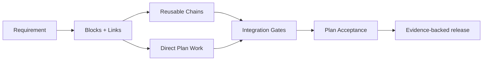

# mdflow · Architecture that stays visible

> **The launch story** — from a requirement, to a graph, to a verified release.

mdflow is a native macOS workspace for AI-assisted software architecture. It keeps Blocks, Links, Chains, Plans, checkpoints, evidence, and source locations connected so an AI can work from the smallest truthful context instead of guessing from a pile of Markdown.

## The five-beat launch

### 01 · See the system

Start with the architecture, not a directory listing. Blocks describe durable responsibilities. Links describe real relationships. Chains make reusable paths visible without owning the Blocks.

### 02 · Plan the work that actually moves

A Plan exposes direct Block work, Chain integration, Link changes, dependency gates, and the final acceptance gate in one ordered view. A Block outside every Chain is still first-class work.

### 03 · Give AI the right amount of context

MCP responses are Markdown-first and deterministic. The context pack starts with coverage and execution order, then shows only the relevant Block changes, paths, rules, checkpoints, and evidence. Full structured data is opt-in when a caller truly needs it.

### 04 · Verify the change, not the prose

Checkpoints bind implementation to evidence. A plain architecture Block can remain checkpoint-free until a requirement or Plan asks for verification. Once verification is required, missing coverage is visible instead of silently inferred.

### 05 · Keep the map stable while the work changes

The Canvas keeps canonical positions stable as lenses change. Top-level checkboxes animate the visible delta, background rules stay out of the graph, and Plan detail opens in place without hiding the path to evidence.

## What ships in v0.1.0

- A native macOS Canvas for architecture, Chain paths, lenses, focus, and semantic zoom.
- Block-level Plan detail with Direct Block Work, ChainScope paths, checkpoint dependencies, and acceptance gates.
- A Markdown-first mdflow MCP surface with explicit JSON opt-in via `includeStructured=true`.
- Scoped project rules that remain available to AI without becoming Canvas nodes.
- Git-versioned `.mdflow` graph storage with checkout replacement detection and live App refresh.
- Foundation Plan generation, direct Block coverage, checkpoint coverage, history diffs, and safe update-only rollback.

## The proof behind the release

| Surface | Current evidence |
| --- | --- |
| MCP | 41/41 tests passed |
| Desktop | 30/30 Swift tests passed |
| Large graph | 300 Blocks / 599 Links / 6 Chains route-safety and endurance checks passed |
| Context parity | 13/13 facts, 0 errors, 0 rework proxy turns, 29.4188% fewer tokens in the mdflow projection |
| Package | `release:verify` valid, strict codesign, private-data audit, 13-file manifest |

## The release rhythm

1. **Read** the scoped context pack.
2. **Open** the exact Plan or Block that matters.
3. **Change** code and graph together.
4. **Verify** with tests, checkpoints, and real-target evidence.
5. **Ship** a clean app bundle with a manifest and checksums.

That sequence is the product: architecture stays legible while implementation moves.

## Install the release candidate

Run `npm run release:assets` on macOS to produce:

- `dist/release/mdflow-0.1.0-macos.zip`
- `dist/release/mdflow-0.1.0-release-manifest.json`
- `dist/release/SHA256SUMS`

The local package is intentionally marked ad-hoc until a Developer ID certificate and notarization profile are supplied. A public release must pass `npm run release:notarize` and Gatekeeper assessment before it is called notarized; `npm run release:upload` refuses to publish an ad-hoc package.

## A quieter way to build

mdflow does not ask the AI to remember the whole repository. It makes the architecture inspectable, the next step ordered, the missing coverage explicit, and the evidence recoverable.

**See the graph. Make the change. Keep the proof.**
