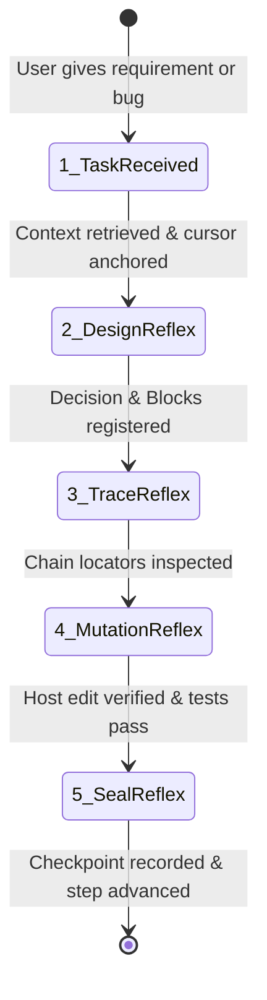

# contextos: Context Operating System for AI Coding Agents

contextos is the canonical development operating system for AI coding agents. It provides a structured, token-budgeted architecture map and path+symbol locators so agents can open only the method they need.

> [!IMPORTANT]
> **Core Mission**: contextos is your **living runtime OS**, not an archive to update after the fact.
> The graph is the source of truth for architecture and intent; the source tree is the source of truth for behavior. `SourceBinding` is the bridge that keeps the two aligned while code moves.
> New architecture must be registered in contextos, while existing bound source is rescanned automatically instead of requiring a full post-hoc documentation pass.
> **Architecture precedes code. Decisions precede implementation.**

---

## 🧠 The AI Cognitive Trigger Protocol: WHEN to Use contextos

Do not treat contextos as a passive tool manual. Follow this **mandatory cognitive reflex machine** throughout your development cycle:



---

### ⚡ Trigger 1: When Receiving ANY Request, Bug, or Feature
* **Your Natural Habit (WRONG)**: Immediately searching files (`grep`/`find`/`ls`), guessing which file to edit, and opening raw files.
* **The contextos Reflex (MANDATORY)**:
  1. **Call `context_for_task(task="...")`**:
     - Locks in the relevant architecture Blocks, execution Chains, and active Plan within a tight token budget.
     - Automatically initializes `.contextos` if the project is brand new.
     - Save the returned `taskContextId`; pass it to `chain_code_stream`, `plan_context`, `entity_open`, `checkpoint_list`, and `changes_since` so focused reads consume one shared task budget instead of several independent responses.
     - Use the default shared budget first; increase `budgetChars` only when the task genuinely needs more context. `includeStructured=true` is an explicit expansion and is capped by the same task budget.
     - `context_for_task` also performs a compact source-binding scan. Read its `sourceSync` summary and use `source_sync` when you need the complete delta; do not copy source code into the synchronization response.
     - **Rule**: Before knowing which Block and Chain the task belongs to, DO NOT open arbitrary source files.
  2. **Call `timeline_sync(nowDoing="...")`**:
     - Anchor your current working cursor immediately so other agents and future prompts have zero ambiguity about the active focus.

---

### ⚡ Trigger 2: When Formulating a Solution or Making Architectural Choices
* **Your Natural Habit (WRONG)**: Keeping the design in your hidden thoughts and directly typing code into files.
* **The contextos Reflex (MANDATORY)**:
  1. **When making a technical trade-off or choosing an approach**:
     - **Trigger**: Call `graph_mutate` with a `create_decision` operation (or review past constraints with `decision_open` / `decision_list`).
     - Record: Why this approach was chosen, what was rejected, and the consequences.
  2. **When creating or altering modules, structs, interfaces, or services**:
     - **Trigger**: Call `graph_patch` or `graph_flow` **BEFORE writing the code**.
     - Declare the Block and its connections:
       ```text
       contextos/1 reason="Introduce editor platform detection engine"
       create block:editor-detector kind=service title="Editor Platform Detector" summary="Detects installed IDEs and reads versions"
       flow: desktop-store -[calls]-> editor-detector
       ```
     - Bind the planned source symbol:
       ```text
       source block:editor-detector path="Sources/ContextOSDesktop/PluginInstaller.swift" symbol="detectAllPlatforms"
       ```
  3. **Validate**: Call `graph_validate()` to guarantee no orphan blocks or broken links.

---

## 🧭 Semantic model and source-of-truth boundary

Keep these concepts separate; do not invent a Plan or a Chain gate merely because a Block exists:

- **Block** is an abstract architecture unit. It may stand alone, participate in serial or parallel networks, and own an independent Checkpoint.
- **Chain** is a higher-level serial/parallel network of Blocks. It may own an integration Checkpoint that is independent of the Blocks' Checkpoints.
- **Plan** records development intent and work scope over Blocks, Chains, and rules. It does not own the architecture and does not need to cover every Block or Chain. Unplanned architecture is valid.
- **Checkpoint** belongs to its declared target. A Block Checkpoint verifies that Block; a Chain Checkpoint verifies integration; a Plan gate verifies the Plan's required scope. A standalone Block Checkpoint is not an error.

Source synchronization follows one stable rule: the file plus `symbol`/method name is the binding identity; `startLine`/`endLine` are derived coordinates. At contextos boundaries (`context_for_task`, `chain_code_stream`, `graph_validate`, checkpoint evaluation, and `run_command`), active bindings are rescanned. `moved` means the symbol was found at a new range, `changed` means its current implementation differs, and `missing`/`ambiguous`/`unreadable` means the current implementation is unsafe to stream or mutate.

Use `source_sync` or `changes_since(sourceSyncRevision=...)` for an explicit compact delta. `chain_code_stream` returns locators only and never implementation bodies. Edit with the host editor at `path` + `symbol`; then call `source_sync` and accept new bindings if needed.

---

### ⚡ Trigger 3: When Tracing Multi-Module Execution Chains
* **Your Natural Habit (WRONG)**: Reading 3–5 full source files (1,000–3,000 lines), wasting 80% of your context window on boilerplate imports, formatting, and unrelated helpers.
* **The contextos Reflex (MANDATORY)**:
  - **Trigger**: Call `chain_code_stream(chainId="...")`:
    - The stream is locator-only: path, symbol, signature, derived line range, source status, and contract.
    - Do not expect implementation bodies. Open `path` at the derived line in the host editor.
    - Treat `sourceStatus="stale"|"missing"|"unreadable"|"ambiguous"` as a stop signal. If it is `ambiguous`, choose an explicit candidate with `source_binding_accept`.
    - Pass the `taskContextId` returned by `context_for_task` so Chain expansion shares the task budget.

---

### ⚡ Trigger 4: When Modifying Code & Running Builds
* **Your Natural Habit (WRONG)**: Performing raw regex or string replacements across large files; if the build fails, leaving broken code behind.
* **The contextos Reflex (MANDATORY)**:
  1. **Edit from locators, never from dumped source**:
     - Open the host editor at the Block locator `path` + `symbol`. Do not read the whole file unless the locator is missing.
     - If the locator is `line_only`, `stale`, `missing`, or `ambiguous`, rebind with `source_binding_suggest` / `source_binding_accept` first.
     - After host edits, call `source_sync` and accept any new binding candidates before recording a checkpoint.
  2. **Command output gateway**:
      - Use `run_command(command="...")` for tests and builds. It captures stdout/stderr, redacts credentials and local paths, compresses routine output, and returns no raw terminal stream.
      - Use `log_sanitize(rawOutput="...")` only for output already supplied by an external tool; it is not the normal command runner.
      - An explicitly allowed external `exec_command` or IDE edit is not forbidden, but it is outside contextos's immediate mutation receipt. Run `source_sync` when returning to the contextos workflow; the next context/stream/validation boundary will also detect the drift.

---

### ⚡ Trigger 5: When Verification Passes & Work is Completed
* **Your Natural Habit (WRONG)**: Saying "I'm done" in chat without leaving verifiable artifacts or moving the timeline.
* **The contextos Reflex (MANDATORY)**:
  1. **Seal verification proof**:
     - Call `checkpoint_record(targetId="...", status="passed", evidenceLevel="integration"|"real_target", title="...", criteria="...")`.
     - An assertion without objective evidence is invalid.
     - Checkpoint freshness is enforced: contextos records Git/source identity and rechecks it on read. If a bound source changes, the checkpoint becomes `retest_required`; historical checkpoints without identity do not satisfy a gate.
  2. **Advance progress cursor**:
     - Call `step_advance(summary="...")` to mark the plan step as completed and push the project cursor forward.
  3. **Sync timeline**:
     - Call `timeline_sync(nowDoing="", nextUp="...")` so the next interaction resumes seamlessly.
  4. **Drift & Completion Gate Check (CRITICAL)**:
     - Call `graph_status` or `graph_validate` before declaring completion.
     - **Zero-Ghost Rule**: If code was implemented on disk, the corresponding Block must have `deliveryState: "complete"`. Never leave implemented blocks as `proposed` (Ghost).
     - Resolve any reported Architecture Drift Alerts before telling the user you are finished.

---

## 🚫 Critical Anti-Patterns (The "Never Do" List)

1. **NEVER edit code before updating the graph**: If a new function, struct, or service does not exist in `.contextos`, create the Block first.
2. **NEVER pollute project roots**: Tool and editor configs (e.g. Cursor, OpenCode, Claude) must only be written to their canonical user/global application support directories unless the project explicitly maintains them.
3. **NEVER dump full files when a locator exists**: Use `path` + `symbol` from the Block/Chain index and open only that method.
4. **NEVER close a required gate without current evidence**: Record a passing Checkpoint for the declared Block, Chain, or Plan gate. Do not create artificial Plan membership or Chain gates just to make standalone architecture look complete.
5. **NEVER use a stale implementation body**: If a source binding is missing, unreadable, or ambiguous, rebind or ask for a decision; never paste the previous slice back into context or mutation.

---

## 🛠️ Complete MCP Tool Reference

| Category | Tool | Mandatory Trigger Moment (WHEN) | Key Arguments |
|---|---|---|---|
| **Orientation** | `context_for_task` | **Task start** — before touching any files. Returns a shared `taskContextId`. | `task`, `projectRoot`, `focusRefs`, `budgetChars` |
| | `graph_status` | **Task start or pre-completion** — inspect architecture drift, ghost nodes, isolated blocks, and gates. | `locale`, `projectRoot` |
| | `entity_open` | Deep-diving into a specific Block, Chain, or Plan contract. | `type`, `id` |
| | `graph_search` | Locating existing architecture elements without loading whole files. | `query`, `kinds` |
| **Architecture** | `graph_patch` | **Design phase** — before adding or modifying code modules. | `patch`, `projectRoot` |
| | `graph_flow` | Connecting pipeline stages via arrow syntax (`A -> B -> C`). | `flow`, `projectRoot` |
| | `graph_mutate` | Fine-grained programmatic operations (e.g. creating decisions). | `operations`, `reason` |
| | `graph_validate` | Verifying architecture integrity after any graph mutation. | `projectRoot` |
| **Source locators** | `chain_code_stream` | **Logic tracing** — locator-only path+symbol index along a Chain. | `chainId`, `maxTotalChars` |
| | `run_command` | **Normal test/build gateway** — execute inside the project and return sanitized output only. | `command`, `cwd`, `timeoutMs`, `maxChars` |
| | `log_sanitize` | Processing large external compiler/test outputs. | `rawOutput`, `exitCode` |
| **Synchronization** | `source_sync` | **After external edits or when a delta is needed** — rescan active bindings and return compact source changes. | `sinceRevision`, `includeUnchanged` |
| **Milestones** | `checkpoint_record` | **Verification phase** — recording objective test/build evidence. | `targetId`, `status`, `evidenceLevel` |
| | `step_advance` | **Completion phase** — moving the active plan step cursor forward. | `summary` |
| | `timeline_sync` | **Handoff / Pause** — updating `nowDoing` and `nextUp`. | `nowDoing`, `nextUp` |
| **Memory** | `decision_open` | Reviewing constraints and rationale before making architectural pivots. | `id` |
| | `decision_list` | Browsing historical decisions made by the team. | (none) |
| | `change_set_revert`| Rolling back an entire architectural transaction if needed. | `changeSetId`, `reason` |
