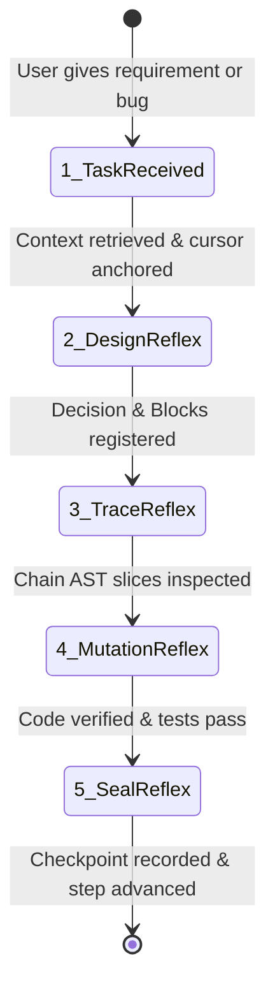

# mdflow: Context Operating System for AI Coding Agents

mdflow is the canonical development operating system for AI coding agents. It provides a structured, token-budgeted architecture map, AST-level code slicing, and safe verified mutation with automatic rollback.

> [!IMPORTANT]
> **Core Mission**: mdflow is your **living runtime OS**, not an archive to update after the fact.
> Every piece of code is a reflection of the architectural graph. If you write code that is not registered in mdflow, you are creating architectural drift and technical debt.
> **Architecture precedes code. Decisions precede implementation.**

---

## 🧠 The AI Cognitive Trigger Protocol: WHEN to Use mdflow

Do not treat mdflow as a passive tool manual. Follow this **mandatory cognitive reflex machine** throughout your development cycle:



---

### ⚡ Trigger 1: When Receiving ANY Request, Bug, or Feature
* **Your Natural Habit (WRONG)**: Immediately searching files (`grep`/`find`/`ls`), guessing which file to edit, and opening raw files.
* **The mdflow Reflex (MANDATORY)**:
  1. **Call `context_for_task(task="...")`**:
     - Locks in the relevant architecture Blocks, execution Chains, and active Plan within a tight token budget.
     - Automatically initializes `.mdflow` if the project is brand new.
     - Save the returned `taskContextId`; pass it to `chain_code_stream`, `plan_context`, `entity_open`, `checkpoint_list`, and `changes_since` so focused reads consume one shared task budget instead of several independent responses.
     - Use the default shared budget first; increase `budgetChars` only when the task genuinely needs more context. `includeStructured=true` is an explicit expansion and is capped by the same task budget.
     - **Rule**: Before knowing which Block and Chain the task belongs to, DO NOT open arbitrary source files.
  2. **Call `timeline_sync(nowDoing="...")`**:
     - Anchor your current working cursor immediately so other agents and future prompts have zero ambiguity about the active focus.

---

### ⚡ Trigger 2: When Formulating a Solution or Making Architectural Choices
* **Your Natural Habit (WRONG)**: Keeping the design in your hidden thoughts and directly typing code into files.
* **The mdflow Reflex (MANDATORY)**:
  1. **When making a technical trade-off or choosing an approach**:
     - **Trigger**: Call `graph_mutate` with a `create_decision` operation (or review past constraints with `decision_open` / `decision_list`).
     - Record: Why this approach was chosen, what was rejected, and the consequences.
  2. **When creating or altering modules, structs, interfaces, or services**:
     - **Trigger**: Call `graph_patch` or `graph_flow` **BEFORE writing the code**.
     - Declare the Block and its connections:
       ```text
       mdflow/1 reason="Introduce editor platform detection engine"
       create block:editor-detector kind=service title="Editor Platform Detector" summary="Detects installed IDEs and reads versions"
       flow: desktop-store -[calls]-> editor-detector
       ```
     - Bind the planned source symbol:
       ```text
       source block:editor-detector path="Sources/MdflowDesktop/PluginInstaller.swift" symbol="detectAllPlatforms"
       ```
  3. **Validate**: Call `graph_validate()` to guarantee no orphan blocks or broken links.

---

### ⚡ Trigger 3: When Tracing Multi-Module Execution Chains
* **Your Natural Habit (WRONG)**: Reading 3–5 full source files (1,000–3,000 lines), wasting 80% of your context window on boilerplate imports, formatting, and unrelated helpers.
* **The mdflow Reflex (MANDATORY)**:
  - **Trigger**: Call `chain_code_stream(chainId="...", mode="contract")`:
    - The default stream is **contract-first**: symbol, signature, source status, line range, and declared contract only.
    - Request `mode="slice"` only for the smallest implementation body needed for a concrete edit; never use it as a substitute for a full-file dump.
    - Treat `sourceStatus="stale"|"missing"|"unreadable"` as a stop signal instead of guessing from adjacent code.
    - This keeps the normal trace small and makes the token budget observable rather than claiming a fixed percentage.
    - Pass the `taskContextId` returned by `context_for_task` so Chain expansion shares the task budget; omitting it is an explicit unbounded escape hatch.

---

### ⚡ Trigger 4: When Modifying Code & Running Builds
* **Your Natural Habit (WRONG)**: Performing raw regex or string replacements across large files; if the build fails, leaving broken code behind.
* **The mdflow Reflex (MANDATORY)**:
  1. **AST-bounded mutation**:
     - Call `block_code_mutate(blockId="...", symbol="...", newCode="...", verifyCommand="...", expectedSourceHash="...")`:
       - Accurately replaces only the target symbol's AST node.
       - `verifyCommand` is required. If the command fails, **mdflow rolls back the file automatically**, ensuring zero broken intermediate states.
       - When editing a file that may have changed since it was read, request the latest Chain stream with `includeStructured=true` and pass its full `sourceHash` as `expectedSourceHash`.
  2. **Command output gateway**:
     - Use `run_command(command="...")` for tests and builds. It captures stdout/stderr, redacts credentials and local paths, compresses routine output, and returns no raw terminal stream.
     - Use `log_sanitize(rawOutput="...")` only for output already supplied by an external tool; it is not the normal command runner.

---

### ⚡ Trigger 5: When Verification Passes & Work is Completed
* **Your Natural Habit (WRONG)**: Saying "I'm done" in chat without leaving verifiable artifacts or moving the timeline.
* **The mdflow Reflex (MANDATORY)**:
  1. **Seal verification proof**:
     - Call `checkpoint_record(targetId="...", status="passed", evidenceLevel="integration"|"real_target", title="...", criteria="...")`.
     - An assertion without objective evidence is invalid.
     - Checkpoint freshness is enforced: mdflow records Git/source identity and rechecks it on read. If a bound source changes, the checkpoint becomes `retest_required`; historical checkpoints without identity do not satisfy a gate.
  2. **Advance progress cursor**:
     - Call `step_advance(summary="...")` to mark the plan step as completed and push the project cursor forward.
  3. **Sync timeline**:
     - Call `timeline_sync(nowDoing="", nextUp="...")` so the next interaction resumes seamlessly.

---

## 🚫 Critical Anti-Patterns (The "Never Do" List)

1. **NEVER edit code before updating the graph**: If a new function, struct, or service does not exist in `.mdflow`, create the Block first.
2. **NEVER pollute project roots**: Tool and editor configs (e.g. Cursor, OpenCode, Claude) must only be written to their canonical user/global application support directories unless the project explicitly maintains them.
3. **NEVER dump full files when AST streams exist**: Always prefer `chain_code_stream` over reading entire multi-hundred-line files.
4. **NEVER declare a task done without a Checkpoint**: Every completed feature or bugfix requires a passing `checkpoint_record` or `step_advance`.

---

## 🛠️ Complete MCP Tool Reference

| Category | Tool | Mandatory Trigger Moment (WHEN) | Key Arguments |
|---|---|---|---|
| **Orientation** | `context_for_task` | **Task start** — before touching any files. Returns a shared `taskContextId`. | `task`, `projectRoot`, `focusRefs`, `budgetChars` |
| | `entity_open` | Deep-diving into a specific Block, Chain, or Plan contract. | `type`, `id` |
| | `graph_search` | Locating existing architecture elements without loading whole files. | `query`, `kinds` |
| **Architecture** | `graph_patch` | **Design phase** — before adding or modifying code modules. | `patch`, `projectRoot` |
| | `graph_flow` | Connecting pipeline stages via arrow syntax (`A -> B -> C`). | `flow`, `projectRoot` |
| | `graph_mutate` | Fine-grained programmatic operations (e.g. creating decisions). | `operations`, `reason` |
| | `graph_validate` | Verifying architecture integrity after any graph mutation. | `projectRoot` |
| **AST Code** | `chain_code_stream` | **Logic tracing** — contract-first flow; expand one slice only when needed. | `chainId`, `mode`, `maxTotalChars` |
| | `block_code_mutate` | **Implementation phase** — exact symbol mutation + source-drift check + auto-rollback. | `blockId`, `symbol`, `newCode`, `verifyCommand`, `expectedSourceHash` |
| | `run_command` | **Normal test/build gateway** — execute inside the project and return sanitized output only. | `command`, `cwd`, `timeoutMs`, `maxChars` |
| | `log_sanitize` | Processing large external compiler/test outputs. | `rawOutput`, `exitCode` |
| **Milestones** | `checkpoint_record` | **Verification phase** — recording objective test/build evidence. | `targetId`, `status`, `evidenceLevel` |
| | `step_advance` | **Completion phase** — moving the active plan step cursor forward. | `summary` |
| | `timeline_sync` | **Handoff / Pause** — updating `nowDoing` and `nextUp`. | `nowDoing`, `nextUp` |
| **Memory** | `decision_open` | Reviewing constraints and rationale before making architectural pivots. | `id` |
| | `decision_list` | Browsing historical decisions made by the team. | (none) |
| | `change_set_revert`| Rolling back an entire architectural transaction if needed. | `changeSetId`, `reason` |
